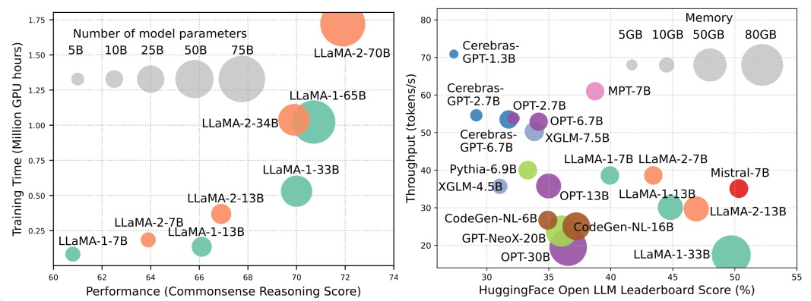

# Efficient Large Language Models: A Survey  

> **[Efficient Large Language Models: A Survey](http://arxiv.org/abs/2312.03863)**[ [arXiv]](http://arxiv.org/abs/2312.03863) (Version 1: 12/06/2023; Version 2: 12/23/2023; Version 3: 01/31/2024; Version 4: 05/23/2024, camera ready version of Transactions on Machine Learning Research)

> *Zhongwei Wan<sup>1</sup>, Xin Wang<sup>1</sup>, Che Liu<sup>2</sup>, Samiul Alam<sup>1</sup>, Yu Zheng<sup>3</sup>, Jiachen Liu<sup>4</sup>, Zhongnan Qu<sup>5</sup>, Shen Yan<sup>6</sup>, Yi Zhu<sup>7</sup>, Quanlu Zhang<sup>8</sup>, Mosharaf Chowdhury<sup>4</sup>, Mi Zhang.<sup>1</sup>*

> *<sup>1</sup>The Ohio State University, <sup>2</sup>Imperial College London, <sup>3</sup>Michigan State University, <sup>4</sup>University of Michigan, <sup>5</sup>Amazon AWS AI, <sup>6</sup>Google Research, <sup>7</sup>Boson AI, <sup>8</sup>Microsoft Research Asia.*
### ⚡News: Our survey has been officially accepted by Transactions on Machine Learning Research (TMLR), May 2024. Camera ready version is available at: [[OpenReview](https://openreview.net/pdf?id=bsCCJHbO8A)]
```
@article{wan2023efficient,
  title={Efficient large language models: A survey},
  author={Wan, Zhongwei and Wang, Xin and Liu, Che and Alam, Samiul and Zheng, Yu and others},
  journal={arXiv preprint arXiv:2312.03863},
  volume={1},
  year={2023},
  publisher={no}
}
```
## ❤️ Community Support

This repository is maintained by <ins>[tuidan](https://github.com/tuidan)</ins> (wang.15980@osu.edu), <ins>[SUSTechBruce](https://github.com/SUSTechBruce)</ins> (wan.512@osu.edu), <ins>[samiul272](https://github.com/samiul272)</ins> (alam.140@osu.edu), and <ins>[mi-zhang](https://github.com/mi-zhang)</ins> (mizhang.1@osu.edu). We welcome feedback, suggestions, and contributions that can help improve this survey and repository so as to make them valuable resources to benefit the entire community.

We will actively maintain this repository by incorporating new research as it emerges. If you have any suggestions regarding our taxonomy, find any missed papers, or update any preprint arXiv paper that has been accepted to some venue, feel free to send us an email or submit a **pull request** using the following markdown format.

```markdown
Paper Title, <ins>Conference/Journal/Preprint, Year</ins>  [[pdf](link)] [[other resources](link)].
```

## 📌 What is This Survey About?

Large Language Models (LLMs) have demonstrated remarkable capabilities in many important tasks and have the potential to make a substantial impact on our society. Such capabilities, however, come with considerable resource demands, highlighting the strong need to develop effective techniques for addressing the efficiency challenges posed by LLMs. In this survey, we provide a systematic and comprehensive review of efficient LLMs research. We organize the literature in a taxonomy consisting of three main categories, covering distinct yet interconnected efficient LLMs topics from <b>model-centric</b>, <b>data-centric</b>, and <b>framework-centric</b> perspective, respectively. We hope our survey and this GitHub repository can serve as valuable resources to help researchers and practitioners gain a systematic understanding of the research developments in efficient LLMs and inspire them to contribute to this important and exciting field. 

## 🤔 Why Efficient LLMs are Needed?



Although LLMs are leading the next wave of AI revolution, the remarkable capabilities of LLMs come at the cost of their substantial resource demands. Figure 1 (left) illustrates the relationship between model performance and model training time in terms of GPU hours for LLaMA series, where the size of each circle is proportional to the number of model parameters. As shown, although larger models are able to achieve better performance, the amounts of GPU hours used for training them grow exponentially as model sizes scale up. In addition to training, inference also contributes quite significantly to the operational cost of LLMs. Figure 2 (right) depicts the relationship between model performance and inference throughput. Similarly, scaling up the model size enables better performance but comes at the cost of lower inference throughput (higher inference latency), presenting challenges for these models in expanding their reach to a broader customer base and diverse applications in a cost-effective way. The high resource demands of LLMs highlight the strong need to develop techniques to enhance the efficiency of LLMs. As shown in Figure 2, compared to LLaMA-1-33B, Mistral-7B, which uses grouped-query attention and sliding window attention to speed up inference, achieves comparable performance and much higher throughput. This superiority highlights the feasibility and significance of designing efficiency techniques for LLMs.

## 📖 Table of Content
- [🤖 Model-Centric Methods](#-Model-Centric) 
  - [Model Compression](#Model-Compression) 
    - [Quantization](#Quantization)
      - [Post-Training Quantization](#Post-Training-Quantization)
        - [Weight-Only Quantization](#Weight-Only-Quantization)
        - [Weight-Activation Co-Quantization](#Weight-Activation-Co-Quantization)
        - [Evaluation of Post-Training Quantization](#Evaluation-of-Post-Training-Quantization)
      - [Quantization-Aware Training](#Quantization-Aware-Training)
    - [Parameter Pruning](#Parameter-Pruning)
      - [Structured Pruning](#Structured-Pruning)
      - [Unstructured Pruning](#Unstructured-Pruning)
    - [Low-Rank Approximation](#Low-Rank-Approximation)
    - [Knowledge Distillation](#Knowledge-Distillation)
      - [White-Box KD](#White-Box-KD)
      - [Black-Box KD](#Black-Box-KD)
    - [Parameter Sharing](#Parameter-Sharing)
  - [Efficient Pre-Training](#Efficient-Pre-Training)
    - [Mixed Precision Training](#Mixed-Precision-Training)
    - [Scaling Models](#Scaling-Models)
    - [Initialization Techniques](#Initialization-Techniques)
    - [Training Optimizers](#Training-Optimizers)
  - [Efficient Fine-Tuning](#Efficient-Fine-Tuning) 
    - [Parameter Efficient Fine-Tuning](#Parameter-Efficient-Fine-Tuning)
      - [Adapter-based Tuning](#Adapter-based-Tuning)
      - [Low-Rank Adaptation](#Low-Rank-Adaptation)
      - [Prefix Tuning](#Prefix-Tuning)
      - [Prompt Tuning](#Prompt-Tuning)
    - [Memory Efficient Fine-Tuning](#Memory-Efficient-Fine-Tuning)
    - [MoE Efficient Supervised Fine-Tuning](#MoE-Efficient-Supervised-Fine-Tuning)
  - [Efficient Inference](#Efficient-Inference)
    - [Parallel Decoding](#Parallel-Decoding)
    - [Speculative Decoding](#Speculative-Decoding)
    - [KV-Cache Optimization](#KV-Cache-Optimization)
  - [Efficient Architecture](#Efficient-Architecture)
    - [Efficient Attention](#Efficient-Attention)
      - [Sharing-based Attention](#Sharing-based-Attention)
      - [Feature Information Reduction](#Feature-Information-Reduction)
      - [Kernelization or Low-Rank](#Kernelization-or-Low-Rank)
      - [Fixed Pattern Strategies](#Fixed-Pattern-Strategies)
      - [Learnable Pattern Strategies](#Learnable-Pattern-Strategies)
    - [Mixture of Experts](#Mixture-of-Experts)
      - [MoE-based LLMs](#MoE-based-LLMs)
      - [Algorithm-Level MoE Optimization](#Algorithm-Level-MoE-Optimization)
    - [Long Context LLMs](#Long-Context-LLMs)
        - [Extrapolation and Interpolation](#Extrapolation-and-Interpolation)
        - [Recurrent Structure](#Recurrent-Structure)
        - [Segmentation and Sliding Window](#Segmentation-and-Sliding-Window)
        - [Memory-Retrieval Augmentation](#Memory-Retrieval-Augmentation)
    - [Transformer Alternative Architecture](#Transformer-Alternative-Architecture)
      - [State Space Models](#State-Space-Models)
      - [Other Sequential Models](#Other-Sequential-Models)
- [🔢 Data-Centric Methods](#-Data-Centric)
  - [Data Selection](#Data-Selection)
    - [Data Selection for Efficient Pre-Training](#Data-Selection-for-Efficient-Pre-Training)
    - [Data Selection for Efficient Fine-Tuning](#Data-Selection-for-Efficient-Fine-Tuning)
  - [Prompt Engineering](#Prompt-Engineering)
    - [Few-Shot Prompting](#Few-Shot-Prompting)
      - [Demonstration Organization](#Demonstration-Organization)
        - [Demonstration Selection](#Demonstration-Selection)
        - [Demonstration Ordering](#Demonstration-Ordering)
      - [Template Formatting](#Template-Formatting)
        - [Instruction Generation](#Instruction-Generation)
        - [Multi-Step Reasoning](#Multi-Step-Reasoning)
        - [Parallel Generation](#Parallel-Generation)
    - [Prompt Compression](#Prompt-Compression)
    - [Prompt Generation](#Prompt-Generation)
- [🧑‍💻 System-Level Efficiency Optimization and LLM Frameworks](#-System-Level-Efficiency-Optimization-and-LLM-Frameworks)
    - [System-Level Efficiency Optimization](#System-Level-Efficiency-Optimization)
      - [System-Level Pre-Training Efficiency Optimization](#System-Level-Pre-Training-Efficiency-Optimization)
      - [System-Level Serving Efficiency Optimization](#System-Level-Serving-Efficiency-Optimization)
        - [Serving System Design](#Serving-System-Design)
        - [Serving Performance Optimization](#Serving-Performance-Optimization)
      - [Algorithm-Hardware Co-Design](#Algorithm-Hardware-Co-Design)
    - [LLM Frameworks](#LLM-Frameworks)

## 🤖 Model-Centric Methods
### Model Compression
#### Quantization
##### Post-Training Quantization
###### Weight-Only Quantization
- I-LLM: Efficient Integer-Only Inference for Fully-Quantized Low-Bit Large Language Models, <ins>arXiv, 2024</ins> [[Paper](https://arxiv.org/abs/2405.17849)] 
- IntactKV: Improving Large Language Model Quantization by Keeping Pivot Tokens Intact, <ins>arXiv, 2024</ins> [[Paper](https://arxiv.org/abs/2403.01241)] 
- OmniQuant: OmniQuant: Omnidirectionally Calibrated Quantization for Large Language Models, <ins>ICLR, 2024</ins> [[Paper](https://arxiv.org/abs/2308.13137)] [[Code](https://github.com/OpenGVLab/OmniQuant)]
- OneBit: Towards Extremely Low-bit Large Language Models, <ins>arXiv, 2024</ins> [[Paper](https://arxiv.org/abs/2402.11295)]
- GPTQ: Accurate Quantization for Generative Pre-trained Transformers, <ins>ICLR, 2023</ins> [[Paper](https://openreview.net/forum?id=tcbBPnfwxS)] [[Code](https://github.com/IST-DASLab/gptq)]
- QuIP: 2-Bit Quantization of Large Language Models With Guarantees, <ins>arXiv, 2023</ins> [[Paper](https://arxiv.org/abs/2307.13304)] [[Code](https://github.com/jerry-chee/QuIP)]
- AWQ: Activation-aware Weight Quantization for LLM Compression and Acceleration, <ins>arXiv, 2023</ins> [[Paper](https://arxiv.org/abs/2306.00978)] [[Code](https://github.com/mit-han-lab/llm-awq)]
- OWQ: Lessons Learned from Activation Outliers for Weight Quantization in Large Language Models, <ins>arXiv, 2023</ins> [[Paper](https://arxiv.org/abs/2306.02272)] [[Code](https://github.com/xvyaward/owq)]
- SpQR: A Sparse-Quantized Representation for Near-Lossless LLM Weight Compression, <ins>arXiv, 2023</ins> [[Paper](https://arxiv.org/pdf/2306.03078)] [[Code](https://github.com/Vahe1994/SpQR)]
- FineQuant: Unlocking Efficiency with Fine-Grained Weight-Only Quantization for LLMs, <ins>NeurIPS-ENLSP, 2023</ins> [[Paper](https://arxiv.org/abs/2308.09723)]
- LLM.int8(): 8-bit Matrix Multiplication for Transformers at Scale, <ins>NeurlPS, 2022</ins> [[Paper](https://openreview.net/forum?id=dXiGWqBoxaD)] [[Code](https://github.com/TimDettmers/bitsandbytes)]
- Optimal Brain Compression: A Framework for Accurate Post-Training Quantization and Pruning, <ins>NeurIPS, 2022</ins> [[Paper](https://arxiv.org/abs/2208.11580)] [[Code](https://github.com/IST-DASLab/OBC)]
- QuantEase: Optimization-based Quantization for Language Models, <ins>arXiv, 2023</ins> [[Paper](https://arxiv.org/abs/2309.01885)] [[Code](https://github.com/linkedin/QuantEase)]
###### Weight-Activation Co-Quantization
- Rotation and Permutation for Advanced Outlier Management and Efficient Quantization of LLMs, <ins>NeurIPS, 2024</ins> [[Paper](https://arxiv.org/abs/2308.13137)] 
- OmniQuant: OmniQuant: Omnidirectionally Calibrated Quantization for Large Language Models, <ins>ICLR, 2024</ins> [[Paper](https://arxiv.org/abs/2308.13137)] [[Code](https://github.com/OpenGVLab/OmniQuant)]
- Intriguing Properties of Quantization at Scale, <ins>NeurIPS, 2023</ins> [[Paper](https://arxiv.org/abs/2305.19268)]
- ZeroQuant-V2: Exploring Post-training Quantization in LLMs from Comprehensive Study to Low Rank Compensation, <ins>arXiv, 2023</ins> [[Paper](https://arxiv.org/abs/2303.08302)] [[Code](https://github.com/microsoft/DeepSpeed)]
- ZeroQuant-FP: A Leap Forward in LLMs Post-Training W4A8 Quantization Using Floating-Point Formats, <ins>NeurIPS-ENLSP, 2023</ins> [[Paper](https://arxiv.org/abs/2307.09782)] [[Code](https://github.com/microsoft/DeepSpeed)]
- OliVe: Accelerating Large Language Models via Hardware-friendly Outlier-Victim Pair Quantization, <ins>ISCA, 2023</ins> [[Paper](https://arxiv.org/abs/2304.07493)] [[Code](https://github.com/clevercool/ANT-Quantization)]
- RPTQ: Reorder-based Post-training Quantization for Large Language Models, <ins>arXiv, 2023</ins> [[Paper](https://arxiv.org/abs/2304.01089)] [[Code](https://github.com/hahnyuan/RPTQ4LLM)]
- Outlier Suppression+: Accurate Quantization of Large Language Models by Equivalent and Optimal Shifting and Scaling, <ins>arXiv, 2023</ins> [[Paper](https://arxiv.org/abs/2304.09145)] [[Code](https://github.com/ModelTC/Outlier_Suppression_Plus)]
- QLLM: Accurate and Efficient Low-Bitwidth Quantization for Large Language Models, <ins>arXiv, 2023</ins> [[Paper](https://arxiv.org/abs/2310.08041)]
- SmoothQuant: Accurate and Efficient Post-Training Quantization for Large Language Models, <ins>ICML, 2023</ins> [[Paper](https://arxiv.org/abs/2211.10438)] [[Code](https://github.com/mit-han-lab/smoothquant)]
- ZeroQuant: Efficient and Affordable Post-Training Quantization for Large-Scale Transformers, <ins>NeurIPS, 2022</ins> [[Paper](https://proceedings.neurips.cc/paper_files/paper/2022/hash/adf7fa39d65e2983d724ff7da57f00ac-Abstract-Conference.html)]

###### Evaluation of Post-Training Quantization
 - Evaluating Quantized Large Language Models, <ins>arXiv, 2024</ins> [[Paper](https://arxiv.org/abs/2402.18158)]
##### Quantization-Aware Training
- The Era of 1-bit LLMs: All Large Language Models are in 1.58 Bits, <ins>arXiv, 2024</ins> [[Paper](https://arxiv.org/abs/2402.17764)]
- FP8-LM: Training FP8 Large Language Models, <ins>arXiv, 2023</ins> [[Paper](https://arxiv.org/abs/2310.18313)]
- Training and inference of large language models using 8-bit floating point, <ins>arXiv, 2023</ins> [[Paper](https://arxiv.org/abs/2309.17224)]
- BitNet: Scaling 1-bit Transformers for Large Language Models, <ins>arXiv, 2023</ins> [[Paper](https://arxiv.org/abs/2310.11453)]
- LLM-QAT: Data-Free Quantization Aware Training for Large Language Models, <ins>arXiv, 2023</ins> [[Paper](https://arxiv.org/abs/2305.17888)] [[Code](https://github.com/facebookresearch/LLM-QAThttps://github.com/facebookresearch/LLM-QAT)]
- Compression of Generative Pre-trained Language Models via Quantization, <ins>ACL, 2022</ins> [[Paper](https://aclanthology.org/2022.acl-long.331.pdf)]
#### Parameter Pruning
##### Structured Pruning
- Compact Language Models via Pruning and Knowledge Distillation, <ins>arXiv, 2024</ins> [[Paper](https://www.arxiv.org/abs/2407.14679)] 
- A deeper look at depth pruning of LLMs, <ins>arXiv, 2024</ins> [[Paper](https://www.arxiv.org/abs/2407.16286)] 
- Perplexed by Perplexity: Perplexity-Based Data Pruning With Small Reference Models, <ins>arXiv, 2024</ins> [[Paper](https://arxiv.org/abs/2405.20541)] 
- Plug-and-Play: An Efficient Post-training Pruning Method for Large Language Models, <ins>ICLR, 2024</ins> [[Paper](https://openreview.net/forum?id=Tr0lPx9woF)] 
- BESA: Pruning Large Language Models with Blockwise Parameter-Efficient Sparsity Allocation, <ins>arXiv, 2024</ins> [[Paper](https://arxiv.org/abs/2402.16880)] 
- ShortGPT: Layers in Large Language Models are More Redundant Than You Expect, <ins>arXiv, 2024</ins> [[Paper](https://arxiv.org/abs/2403.03853)] 
- NutePrune: Efficient Progressive Pruning with Numerous Teachers for Large Language Models, <ins>arXiv, 2024</ins> [[Paper](https://arxiv.org/abs/2402.09773)] 
- SliceGPT: Compress Large Language Models by Deleting Rows and Columns, <ins>ICLR, 2024</ins> [[Paper](https://arxiv.org/abs/2401.15024)] [[Code](https://github.com/microsoft/TransformerCompression?utm_source=catalyzex.com)]
- LoRAShear: Efficient Large Language Model Structured Pruning and Knowledge Recovery, <ins>arXiv, 2023</ins> [[Paper](https://arxiv.org/abs/2310.18356)]
- LLM-Pruner: On the Structural Pruning of Large Language Models, <ins>NeurIPS, 2023</ins> [[Paper](https://arxiv.org/abs/2305.11627)] [[Code](https://github.com/horseee/LLM-Pruner)]
- Sheared LLaMA: Accelerating Language Model Pre-training via Structured Pruning, <ins> NeurIPS-ENLSP, 2023</ins> [[Paper](https://arxiv.org/abs/2310.06694)] [[Code](https://github.com/princeton-nlp/LLM-Shearing)]
- LoRAPrune: Pruning Meets Low-Rank Parameter-Efficient Fine-Tuning, <ins>arXiv, 2023</ins> [[Paper](https://doi.org/10.48550/arXiv.2305.18403)]
- LoRAP: Transformer Sub-Layers Deserve Differentiated Structured Compression for Large Language Models, <ins>ICML, 2024</ins> [[Paper](https://arxiv.org/abs/2404.09695)][[Code](https://github.com/lihuang258/LoRAP)]
##### Unstructured Pruning
- MaskLLM: Learnable Semi-Structured Sparsity for Large Language Models, <ins>NIPS, 2024</ins> [[Paper](https://arxiv.org/abs/2409.17481)] 
- Dynamic Sparse No Training: Training-Free Fine-tuning for Sparse LLMs, <ins>ICLR, 2024</ins> [[Paper](https://arxiv.org/abs/2310.08915)] 
- SparseGPT: Massive Language Models Can Be Accurately Pruned in One-Shot, <ins>ICML, 2023</ins> [[Paper](https://arxiv.org/abs/2301.00774)] [[Code](https://github.com/IST-DASLab/sparsegpt)]
- A Simple and Effective Pruning Approach for Large Language Models, <ins>arXiv, 2023</ins> [[Paper](https://arxiv.org/abs/2306.11695)] [[Code](https://github.com/locuslab/wanda)]
- One-Shot Sensitivity-Aware Mixed Sparsity Pruning for Large Language Models, <ins>arXiv, 2023</ins> [[Paper](https://arxiv.org/pdf/2310.09499v1.pdf)]
#### Low-Rank Approximation
- SVD-LLM: Singular Value Decomposition for Large Language Model Compression, <ins>arXiv, 2024</ins> [[Paper](https://arxiv.org/abs/2403.07378)] [[Code](https://github.com/AIoT-MLSys-Lab/SVD-LLM)]
- ASVD: Activation-aware Singular Value Decomposition for Compressing Large Language Models, <ins>arXiv, 2023</ins> [[Paper](https://arxiv.org/abs/2312.05821)] [[Code](https://github.com/hahnyuan/ASVD4LLM)]
- Language model compression with weighted low-rank factorization, <ins>ICLR, 2022</ins> [[Paper](https://arxiv.org/abs/2207.00112)]
- TensorGPT: Efficient Compression of the Embedding Layer in LLMs based on the Tensor-Train Decomposition, <ins>arXiv, 2023</ins> [[Paper](https://doi.org/10.48550/arXiv.2307.00526)]
- LoSparse: Structured Compression of Large Language Models based on Low-Rank and Sparse Approximation, <ins>ICML, 2023</ins>  [[Paper](https://arxiv.org/abs/2306.11222)] [[Code](https://github.com/yxli2123/LoSparse)]
#### Knowledge Distillation
##### White-Box KD
- DDK: Distilling Domain Knowledge for Efficient Large Language Models <ins>arXiv, 2024</ins> [[Paper](https://arxiv.org/abs/2407.16154)]
- Rethinking Kullback-Leibler Divergence in Knowledge Distillation for Large Language Models <ins>arXiv, 2024</ins> [[Paper](https://arxiv.org/abs/2404.02657)]
- DistiLLM: Towards Streamlined Distillation for Large Language Models, <ins>arXiv, 2024</ins> [[Paper](https://arxiv.org/abs/2402.03898)] [[Code](https://github.com/jongwooko/distillm)]
- Towards the Law of Capacity Gap in Distilling Language Models, <ins>arXiv, 2023</ins> [[Paper](https://arxiv.org/abs/2311.07052)] [[Code](https://github.com/GeneZC/MiniMA)]
- Baby Llama: Knowledge Distillation from an Ensemble of Teachers Trained on a Small Dataset with no Performance Penalty, <ins>arXiv, 2023</ins> [[Paper](https://arxiv.org/abs/2308.02019)]
- Knowledge Distillation of Large Language Models, <ins>arXiv, 2023</ins> [[Paper](https://arxiv.org/abs/2306.08543)] [[Code](https://github.com/microsoft/LMOps/tree/main/minillm)]
- GKD: Generalized Knowledge Distillation for Auto-regressive Sequence Models, <ins>arXiv, 2023</ins> [[Paper](https://arxiv.org/abs/2306.13649)]
- Propagating Knowledge Updates to LMs Through Distillation, <ins>arXiv, 2023</ins> [[Paper](https://arxiv.org/abs/2306.09306)] [[Code](https://github.com/shankarp8/knowledge_distillation)]
- Less is More: Task-aware Layer-wise Distillation for Language Model Compression, <ins>ICML, 2023</ins> [[Paper](https://arxiv.org/pdf/2210.01351.pdf)]
- Token-Scaled Logit Distillation for Ternary Weight Generative Language Models, <ins>arXiv, 2023</ins> [[Paper](https://arxiv.org/abs/2308.06744)]
##### Black-Box KD
- Zephyr: Direct Distillation of LM Alignment, <ins>arXiv, 2023</ins> [[Paper](https://arxiv.org/abs/2312.09571)]
- Instruction Tuning with GPT-4, <ins>arXiv, 2023</ins> [[Paper](https://arxiv.org/abs/2304.03277)] [[Code](https://github.com/Instruction-Tuning-with-GPT-4/GPT-4-LLM)]
- Lion: Adversarial Distillation of Closed-Source Large Language Model, <ins>arXiv, 2023</ins> [[Paper](https://arxiv.org/abs/2305.12870)] [[Code](https://github.com/YJiangcm/Lion)]
- Specializing Smaller Language Models towards Multi-Step Reasoning, <ins>ICML, 2023</ins> [[Paper](https://aclanthology.org/2022.findings-naacl.169.pdf)] [[Code](https://github.com/FranxYao/FlanT5-CoT-Specialization)]
- Distilling Step-by-Step! Outperforming Larger Language Models with Less Training Data and Smaller Model Sizes, <ins>ACL, 2023</ins> [[Paper](https://arxiv.org/abs/2305.02301)]
- Large Language Models Are Reasoning Teachers, <ins>ACL, 2023</ins> [[Paper](https://arxiv.org/abs/2212.10071)] [[Code](https://github.com/itsnamgyu/reasoning-teacher)]
- SCOTT: Self-Consistent Chain-of-Thought Distillation, <ins>ACL, 2023</ins> [[Paper](https://arxiv.org/abs/2305.01879)] [[Code](https://github.com/wangpf3/consistent-CoT-distillation)]
- Symbolic Chain-of-Thought Distillation: Small Models Can Also "Think" Step-by-Step, <ins>ACL, 2023</ins> [[Paper](https://arxiv.org/abs/2306.14050)]
- Distilling Reasoning Capabilities into Smaller Language Models, <ins>ACL, 2023</ins> [[Paper](https://aclanthology.org/2023.findings-acl.441/)] [[Code](https://github.com/kumar-shridhar/Distiiling-LM)]
- In-context Learning Distillation: Transferring Few-shot Learning Ability of Pre-trained Language Models, <ins>arXiv, 2022</ins> [[Paper](https://arxiv.org/abs/2212.10670)]
- Explanations from Large Language Models Make Small Reasoners Better, <ins>arXiv, 2022</ins> [[Paper](https://arxiv.org/abs/2210.06726)]
- DISCO: Distilling Counterfactuals with Large Language Models, <ins>arXiv, 2022</ins> [[Paper](https://arxiv.org/abs/2212.10534)] [[Code](https://github.com/eric11eca/disco)]
##### Parameter-Sharing
- MobiLlama: Towards Accurate and Lightweight Fully Transparent GPT, <ins>arXiv, 2024</ins> [[Paper](https://arxiv.org/abs/2402.16840)] 
### Efficient Pre-Training
#### Mixed Precision Training
- Bfloat16 Processing for Neural Networks, <ins>ARITH, 2019</ins> [[Paper](https://ieeexplore.ieee.org/document/8877390)]
- A Study of BFLOAT16 for Deep Learning Training, <ins>arXiv, 2019</ins> [[Paper](https://arxiv.org/abs/1905.12322)]
- Mixed Precision Training, <ins>ICLR, 2018</ins> [[Paper](https://openreview.net/forum?id=r1gs9JgRZ)]
#### Scaling Models
- lemon: lossless model expansion, <ins>ICLR, 2024</ins> [[Paper](https://arxiv.org/abs/2310.07999)] 
- Preparing Lessons for Progressive Training on Language Models, <ins>AAAI, 2024</ins> [[Paper](https://arxiv.org/abs/2401.09192)] 
- Learning to Grow Pretrained Models for Efficient Transformer Training, <ins>ICLR, 2023</ins> [[Paper](https://openreview.net/pdf?id=cDYRS5iZ16f)] [[Code](https://github.com/VITA-Group/LiGO)]
- 2x Faster Language Model Pre-training via Masked Structural Growth, <ins>arXiv, 2023</ins> [[Paper](https://arxiv.org/abs/2305.02869)]
- Reusing Pretrained Models by Multi-linear Operators for Efficient Training, <ins>NeurIPS, 2023</ins> [[Paper](https://openreview.net/pdf?id=RgNXKIrWyU)]
- FLM-101B: An Open LLM and How to Train It with $100 K Budget, <ins>arXiv, 2023</ins> [[Paper](https://arxiv.org/pdf/2309.03852.pdf)] [[Code](https://huggingface.co/CofeAI/FLM-101B)]
- Knowledge Inheritance for Pre-trained Language Models, <ins>NAACL, 2022</ins> [[Paper](https://aclanthology.org/2022.naacl-main.288/)] [[Code](https://github.com/thunlp/Knowledge-Inheritance)]
- Staged Training for Transformer Language Models, <ins>ICML, 2022</ins> [[Paper](https://proceedings.mlr.press/v162/shen22f/shen22f.pdf)] [[Code](https://github.com/allenai/staged-training)]
#### Initialization Techniques
- Deepnet: Scaling transformers to 1,000 layers, <ins>arXiv, 2022</ins> [[Paper](https://arxiv.org/abs/2203.00555)] [[Code](https://github.com/microsoft/torchscale)]
- ZerO Initialization: Initializing Neural Networks with only Zeros and Ones, <ins>TMLR, 2022</ins> [[Paper](https://openreview.net/pdf?id=1AxQpKmiTc)] [[Code](https://github.com/jiaweizzhao/ZerO-initialization)]
- Rezero is All You Need: Fast Convergence at Large Depth, <ins>UAI, 2021</ins> [[Paper](https://proceedings.mlr.press/v161/bachlechner21a/bachlechner21a.pdf)] [[Code](https://github.com/majumderb/rezero)]
- Batch Normalization Biases Residual Blocks Towards the Identity Function in Deep Networks, <ins>NeurIPS, 2020</ins> [[Paper](https://papers.neurips.cc/paper/2020/file/e6b738eca0e6792ba8a9cbcba6c1881d-Paper.pdf)]
- Improving Transformer Optimization Through Better Initialization, <ins>ICML, 2020</ins> [[Paper](https://proceedings.mlr.press/v119/huang20f/huang20f.pdf)] [[Code](https://github.com/layer6ai-labs/T-Fixup)]
- Fixup Initialization: Residual Learning without Normalization, <ins>ICLR, 2019</ins> [[Paper](https://openreview.net/pdf?id=H1gsz30cKX)]
- On Weight Initialization in Deep Neural Networks, <ins>arXiv, 2017</ins> [[Paper](https://arxiv.org/abs/1704.08863)]
#### Training Optimizers
- Towards Optimal Learning of Language Models, <ins>arXiv, 2024</ins> [[Paper](https://arxiv.org/abs/2402.17759)] [[Code](https://github.com/microsoft/LMOps/tree/main/learning_law)]
- Symbolic Discovery of Optimization Algorithms, <ins>arXiv, 2023</ins> [[Paper](https://arxiv.org/abs/2302.06675)]
- Sophia: A Scalable Stochastic Second-order Optimizer for Language Model Pre-training, <ins>arXiv, 2023</ins> [[Paper](https://arxiv.org/abs/2305.14342)] [[Code](https://github.com/Liuhong99/Sophia)]

### Efficient Fine-Tuning
#### Parameter-Efficient Fine-Tuning
##### Adapter-based Tuning
- OpenDelta: A Plug-and-play Library for Parameter-efficient Adaptation of Pre-trained Models, <ins>ACL Demo, 2023</ins> [[Paper](https://aclanthology.org/2023.acl-demo.26/)] [[Code](https://github.com/thunlp/OpenDelta)]
- LLM-Adapters: An Adapter Family for Parameter-Efficient Fine-Tuning of Large Language Models, <ins>EMNLP, 2023</ins> [[Paper](https://arxiv.org/pdf/2304.01933.pdf)] [[Code](https://github.com/AGI-Edgerunners/LLM-Adapters)]
- Compacter: Efficient Low-Rank Hypercomplex Adapter Layers, <ins>NeurIPS, 2023</ins> [[Paper](https://openreview.net/forum?id=bqGK5PyI6-N)] [[Code](https://github.com/rabeehk/compacter)]
- Few-Shot Parameter-Efficient Fine-Tuning is Better and Cheaper than In-Context Learning, <ins>NeurIPS, 2022</ins> [[Paper](https://openreview.net/forum?id=rBCvMG-JsPd)] [[Code](https://github.com/r-three/t-few)]
- Meta-Adapters: Parameter Efficient Few-shot Fine-tuning through Meta-Learning, <ins>AutoML, 2022</ins> [[Paper](https://openreview.net/forum?id=BCGNf-prLg5)]
- AdaMix: Mixture-of-Adaptations for Parameter-efficient Model Tuning, <ins>EMNLP, 2022</ins> [[Paper](https://aclanthology.org/2022.emnlp-main.388/)] [[Code](https://github.com/microsoft/AdaMix)]
- SparseAdapter: An Easy Approach for Improving the Parameter-Efficiency of Adapters, <ins>EMNLP, 2022</ins> [[Paper](https://aclanthology.org/2022.findings-emnlp.160/)] [[Code](https://github.com/Shwai-He/SparseAdapter)]
##### Low-Rank Adaptation
- HydraLoRA: An Asymmetric LoRA Architecture for Efficient Fine-Tuning, <ins>NeurIPS, 2024</ins> [[Paper](https://arxiv.org/pdf/2404.19245)]
- LOFIT: Localized Fine-tuning on LLM Representations, <ins>Arxiv, 2024</ins> [[Paper](https://arxiv.org/abs/2406.01563)]
- Mixture-of-Subspaces in Low-Rank Adaptation, <ins>Arxiv, 2024</ins> [[Paper](https://arxiv.org/pdf/2406.11909)] [[Code](https://github.com/wutaiqiang/MoSLoRA)]
- MEFT: Memory-Efficient Fine-Tuning through Sparse Adapter, <ins>ACL, 2024</ins> [[Paper](https://arxiv.org/html/2406.04984v1)]
- LoRA Meets Dropout under a Unified Framework, <ins>arXiv, 2024</ins> [[Paper](https://arxiv.org/abs/2403.00812)]
- STAR: Constraint LoRA with Dynamic Active Learning for Data-Efficient Fine-Tuning of Large Language Models, <ins>arXiv, 2024</ins> [[Paper](https://arxiv.org/abs/2403.01165)]
- LoRA+: Efficient Low Rank Adaptation of Large Models, <ins>arXiv, 2024</ins> [[Paper](https://arxiv.org/abs/2402.12354)]
- LoRA-FA: Memory-efficient Low-rank Adaptation for Large Language Models Fine-tuning, <ins>arXiv, 2023</ins> [[Paper](https://arxiv.org/abs/2308.03303)]
- LoraHub: Efficient Cross-Task Generalization via Dynamic LoRA Composition, <ins>arXiv, 2023</ins> [[Paper](https://arxiv.org/abs/2307.13269)] [[Code](https://github.com/sail-sg/lorahub)]
- LongLoRA: Efficient Fine-tuning of Long-Context Large Language Models, <ins>arXiv, 2023</ins> [[Paper](https://arxiv.org/abs/2309.12307)] [[Code](https://github.com/dvlab-research/LongLoRA)]
- Multi-Head Adapter Routing for Cross-Task Generalization, <ins>NeurIPS, 2023</ins> [[Paper](https://arxiv.org/abs/2211.03831)] [[Code](https://github.com/microsoft/mttl)]
- Adaptive Budget Allocation for Parameter-Efficient Fine-Tuning, <ins>ICLR, 2023</ins> [[Paper](https://arxiv.org/pdf/2303.10512)] 
- DyLoRA: Parameter-Efficient Tuning of Pretrained Models using Dynamic Search-Free Low Rank Adaptation, <ins>EACL, 2023</ins> [[Paper](https://aclanthology.org/2023.eacl-main.239/)] [[Code](https://github.com/huawei-noah/KD-NLP/tree/main/DyLoRA)]
- Tied-Lora: Enhacing Parameter Efficiency of LoRA with Weight Tying, <ins>arXiv, 2023</ins> [[Paper](https://arxiv.org/abs/2311.09578)]
- LoRA: Low-Rank Adaptation of Large Language Models, <ins>ICLR, 2022</ins> [[Paper](https://openreview.net/forum?id=nZeVKeeFYf9)] [[Code](https://github.com/microsoft/LoRA)]
##### Prefix Tuning
- LLaMA-Adapter: Efficient Fine-tuning of Language Models with Zero-init Attention, <ins>arXiv, 2023</ins> [[Paper](https://doi.org/10.48550/arXiv.2303.16199)] [[Code](https://github.com/ZrrSkywalker/LLaMA-Adapter)]
- Prefix-Tuning: Optimizing Continuous Prompts for Generation <ins>ACL, 2021</ins> [[Paper](https://aclanthology.org/2021.acl-long.353/)] [[Code](https://github.com/XiangLi1999/PrefixTuning)]
##### Prompt Tuning
- Compress, Then Prompt: Improving Accuracy-Efficiency Trade-off of LLM Inference with Transferable Prompt, <ins>arXiv, 2023</ins> [[Paper](https://arxiv.org/abs/2305.11186v2)]
- GPT Understands, Too, <ins>AI Open, 2023</ins> [[Paper](https://doi.org/10.1016/j.aiopen.2023.08.012)] [[Code](https://github.com/THUDM/P-tuning)]
- Multi-Task Pre-Training of Modular Prompt for Few-Shot Learning <ins>ACL, 2023</ins> [[Paper](https://arxiv.org/abs/2210.07565)] [[Code](https://github.com/Hzfinfdu/MPMP)]
- Multitask Prompt Tuning Enables Parameter-Efficient Transfer Learning, <ins>ICLR, 2023</ins> [[Paper](https://arxiv.org/abs/2303.02861)]
- PPT: Pre-trained Prompt Tuning for Few-shot Learning, <ins>ACL, 2022</ins> [[Paper](https://arxiv.org/abs/2109.04332)] [[Code](https://github.com/thu-coai/PPT)]
- Parameter-Efficient Prompt Tuning Makes Generalized and Calibrated Neural Text Retrievers, <ins>EMNLP-Findings, 2022</ins> [[Paper](https://arxiv.org/abs/2207.07087)] [[Code](https://github.com/THUDM/P-tuning-v2/tree/main/PT-Retrieval)]
- P-Tuning v2: Prompt Tuning Can Be Comparable to Finetuning Universally Across Scales and Tasks，<ins>ACL-Short, 2022</ins> [[Paper](https://aclanthology.org/2022.acl-short.8/)] [[Code](https://github.com/THUDM/P-tuning-v2)]
- The Power of Scale for Parameter-Efficient Prompt Tuning, <ins>EMNLP, 2021</ins> [[Paper](https://arxiv.org/abs/2104.08691)]
#### Memory-Efficient Fine-Tuning
- A Study of Optimizations for Fine-tuning Large Language Models, <ins>arXiv, 2024/ins> [[Paper](https://arxiv.org/abs/2406.02290)] 
- Sparse Matrix in Large Language Model Fine-tuning, <ins>arXiv, 2024/ins> [[Paper](https://arxiv.org/pdf/2405.15525)] 
- GaLore: Memory-Efficient LLM Training by Gradient Low-Rank Projection, <ins>arXiv, 2024/ins> [[Paper](https://arxiv.org/abs/2403.03507)] 
- ReFT: Representation Finetuning for Language Models, <ins>arXiv, 2024/ins> [[Paper](https://arxiv.org/abs/2404.03592)] 
- LISA: Layerwise Importance Sampling for Memory-Efficient Large Language Model Fine-Tuning, <ins>arXiv, 2024/ins> [[Paper](https://arxiv.org/abs/2403.17919)] 
- BitDelta: Your Fine-Tune May Only Be Worth One Bit, <ins>arXiv, 2024/ins> [[Paper](https://arxiv.org/abs/2402.10193)] 
- Winner-Take-All Column Row Sampling for Memory Efficient Adaptation of Language Model, <ins>NeurIPS, 2023</ins> [[Paper](https://arxiv.org/abs/2305.15265)] [[Code](https://github.com/zirui-ray-liu/WTACRS)]
- Memory-Efficient Selective Fine-Tuning, <ins>ICML Workshop, 2023</ins> [[Paper](https://openreview.net/forum?id=zaNbLceVwm)]
- Full Parameter Fine-tuning for Large Language Models with Limited Resources, <ins>arXiv, 2023</ins> [[Paper](https://arxiv.org/abs/2306.09782)] [[Code](https://github.com/OpenLMLab/LOMO)]
- Fine-Tuning Language Models with Just Forward Passes, <ins>NeurIPS, 2023</ins> [[Paper](https://arxiv.org/abs/2305.17333)] [[Code](https://github.com/princeton-nlp/MeZO)]
- Memory-Efficient Fine-Tuning of Compressed Large Language Models via sub-4-bit Integer Quantization, <ins>NeurIPS, 2023</ins> [[Paper](https://arxiv.org/abs/2305.14152)]
- LoftQ: LoRA-Fine-Tuning-Aware Quantization for Large Language Models, <ins>arXiv, 2023</ins> [[Paper](https://arxiv.org/abs/2310.08659)] [[Code](https://github.com/yxli2123/LoftQ)]
- QA-LoRA: Quantization-Aware Low-Rank Adaptation of Large Language Models, <ins>arXiv, 2023</ins> [[Paper](https://arxiv.org/abs/2309.14717 )] [[Code](https://github.com/yuhuixu1993/qa-lora)]
- QLoRA: Efficient Finetuning of Quantized LLMs, <ins>NeurIPS, 2023</ins> [[Paper](https://arxiv.org/abs/2305.14314)] [[Code1](https://github.com/artidoro/qlora)] [[Code2](https://github.com/TimDettmers/bitsandbytes)]
#### MoE-Efficient-Supervised-Fine-Tuning
- Let the Expert Stick to His Last: Expert-Specialized Fine-Tuning for Sparse Architectural Large Language Models, <ins>arXiv, 2024</ins> [[Paper](https://arxiv.org/html/2407.01906v1)] 
### Efficient Inference
#### Parallel Decoding
- CLLMs: Consistency Large Language Models, <ins>arXiv, 2024</ins> [[Paper](https://arxiv.org/abs/2403.00835)]
- Encode Once and Decode in Parallel: Efficient Transformer Decoding, <ins>arXiv, 2024</ins> [[Paper](https://arxiv.org/abs/2403.13112)]
#### Speculative Decoding
- MagicDec: Breaking the Latency-Throughput Tradeoff for Long Context Generation with Speculative Decoding, <ins>arXiv, 2024</ins> [[Paper](https://arxiv.org/html/2408.11049v1)]
- DeFT: Decoding with Flash Tree-attention for Efficient Tree-structured LLM Inference, <ins>arXiv, 2024</ins> [[Paper](https://arxiv.org/abs/2404.00242)]
- LayerSkip: Enabling Early Exit Inference and Self-Speculative Decoding, <ins>arXiv, 2024</ins> [[Paper](https://arxiv.org/abs/2404.16710)]
- TriForce: Lossless Acceleration of Long Sequence Generation with Hierarchical Speculative Decoding, <ins>arXiv, 2024</ins> [[Paper](https://github.com/Infini-AI-Lab/TriForce)]
- REST: Retrieval-Based Speculative Decoding, <ins>arXiv, 2024</ins> [[Paper](https://github.com/FasterDecoding/REST)]
- Tandem Transformers for Inference Efficient LLMs, <ins>arXiv, 2024</ins> [[Paper](https://arxiv.org/abs/2402.08644)]
- PaSS: Parallel Speculative Sampling, <ins>NeurIPS Workshop, 2023</ins> [[Paper](https://arxiv.org/abs/2311.13581)]
- Accelerating Transformer Inference for Translation via Parallel Decoding, <ins>ACL, 2023</ins> [[Paper](https://aclanthology.org/2023.acl-long.689/)] [[Code](https://github.com/hao-ai-lab/LookaheadDecoding)]
- Medusa: Simple Framework for Accelerating LLM Generation with Multiple Decoding Heads, <ins>Blog, 2023</ins> [[Blog](https://sites.google.com/view/medusa-llm)] [[Code](https://github.com/FasterDecoding/Medusa)]
- Fast Inference from Transformers via Speculative Decoding, <ins>ICML, 2023</ins> [[Paper](https://arxiv.org/abs/2211.17192)]
- Accelerating LLM Inference with Staged Speculative Decoding, <ins>ICML Workshop, 2023</ins> [[Paper](https://arxiv.org/abs/2308.04623)]
- Accelerating Large Language Model Decoding with Speculative Sampling, <ins>arXiv, 2023</ins> [[Paper](https://arxiv.org/abs/2302.01318)]
- Speculative Decoding with Big Little Decoder, <ins>NeurIPS, 2023</ins> [[Paper](https://arxiv.org/abs/2302.07863)] [[Code](https://github.com/kssteven418/BigLittleDecoder)]
- SpecInfer: Accelerating Generative LLM Serving with Speculative Inference and Token Tree Verification, <ins>arXiv, 2023</ins>  [[Paper](https://doi.org/10.48550/arXiv.2305.09781)] [[Code](https://github.com/flexflow/FlexFlow)]
- Inference with Reference: Lossless Acceleration of Large Language Models, <ins>arXiv, 2023</ins> [[Paper](https://arxiv.org/abs/2304.04487)] [[Code](https://github.com/microsoft/LMOps/tree/main/llma)]
- SEED: Accelerating Reasoning Tree Construction via Scheduled Speculative Decoding, <ins>arXiv, 2024</ins> [[Paper]([https://arxiv.org/abs/2304.04487](https://arxiv.org/pdf/2406.18200))]
#### KV-Cache Optimization
- CAKE: Cascading and Adaptive KV Cache Eviction with Layer Preferences, <ins>ICLR, 2025</ins>  [[Paper](https://openreview.net/forum?id=EQgEMAD4kv)]
- SCOPE: Optimizing Key-Value Cache Compression in Long-context Generation, <ins>arXiv, 2024</ins>  [[Paper](https://arxiv.org/abs/2412.13649)]
- vl-cache: sparsity and modality-aware kv cache compression for vision-language model inference acceleration, <ins>arXiv, 2024</ins>  [[Paper](https://arxiv.org/abs/2410.23317)]
- MInference 1.0: Accelerating Pre-filling for Long-Context LLMs via Dynamic Sparse Attention, <ins>arXiv, 2024</ins>  [[Paper](https://arxiv.org/abs/2407.02490)]
- KVSharer: Efficient Inference via Layer-Wise Dissimilar KV Cache Sharing, <ins>arXiv, 2024</ins>  [[Paper](https://arxiv.org/abs/2410.18517)]
- DuoAttention: Efficient Long-Context LLM Inference with Retrieval and Streaming Heads, <ins>arXiv, 2024</ins>  [[Paper](https://arxiv.org/abs/2410.10819)]
- LazyLLM: Dynamic Token Pruning for Efficient Long Context LLM Inference, <ins>arXiv, 2024</ins>  [[Paper](https://huggingface.co/papers/2407.14057)]
- Palu: Compressing KV-Cache with Low-Rank Projection, <ins>arXiv, 2024</ins>  [[Paper](https://huggingface.co/papers/2407.21118)] [[Code](https://github.com/shadowpa0327/Palu)]
- LOOK-M: Look-Once Optimization in KV Cache for Efficient Multimodal Long-Context Inference, <ins>arXiv, 2024</ins> [[Paper](https://arxiv.org/html/2406.18139v1)]
- D2O: Dynamic Discriminative Operations for Efficient Generative Inference of Large Language Models, <ins>arXiv, 2024</ins> [[Paper](https://arxiv.org/html/2406.13035v1)]
- QUEST: Query-Aware Sparsity for Efficient Long-Context LLM Inference, <ins>ICML, 2024</ins> [[Paper](https://hanlab.mit.edu/projects/quest)]
- Reducing Transformer Key-Value Cache Size with Cross-Layer Attention, <ins>arXiv, 2024</ins> [[Paper](https://arxiv.org/abs/2405.12981)]
- SnapKV : LLM Knows What You are Looking for Before Generation, <ins>arXiv, 2024</ins> [[Paper](https://huggingface.co/papers/2404.14469)]
- Anchor-based Large Language Models, <ins>arXiv, 2024</ins> [[Paper](https://arxiv.org/abs/2402.07616)]
- kvquant: Towards 10 million context length llm inference with kv cache quantization, <ins>arXiv, 2024</ins> [[Paper](https://arxiv.org/abs/2401.18079)]
- GEAR: An Efficient KV Cache Compression Recipe for Near-Lossless Generative Inference of LLM, <ins>arXiv, 2024</ins> [[Paper](https://arxiv.org/abs/2403.05527)]
- Dynamic Memory Compression: Retrofitting LLMs for Accelerated Inference, <ins>arXiv, 2024</ins> [[Paper](https://arxiv.org/abs/2403.09636)]
- No Token Left Behind: Reliable KV Cache Compression via Importance-Aware Mixed Precision Quantization, <ins>arXiv, 2024</ins> [[Paper](https://arxiv.org/abs/2402.18096)]
- Get More with LESS: Synthesizing Recurrence with KV Cache Compression for Efficient LLM Inference, <ins>arXiv, 2024</ins> [[Paper](https://arxiv.org/abs/2402.09398)]
- WKVQuant: Quantizing Weight and Key/Value Cache for Large Language Models Gains More, <ins>arXiv, 2024</ins> [[Paper](https://zhuanzhi.ai/paper/6045a748004aa13e00d0cc6c8aceca4f)]
- On the Efficacy of Eviction Policy for Key-Value Constrained Generative Language Model Inference, <ins>arXiv, 2024</ins> [[Paper](https://arxiv.org/abs/2402.06262)]
- KIVI: A Tuning-Free Asymmetric 2bit Quantization for KV Cache, <ins>arXiv, 2024</ins> [[Paper](https://arxiv.org/abs/2402.02750)] [[Code](https://github.com/jy-yuan/KIVI)]
- Model Tells You What to Discard: Adaptive KV Cache Compression for LLMs, <ins>ICLR, 2024</ins> [[Paper](https://paperswithcode.com/paper/model-tells-you-what-to-discard-adaptive-kv)]
- SkipDecode: Autoregressive Skip Decoding with Batching and Caching for Efficient LLM Inference, <ins>arXiv, 2023</ins> [[Paper](https://arxiv.org/abs/2307.02628)]
- H2O: Heavy-Hitter Oracle for Efficient Generative Inference of Large Language Models, <ins>NeurIPS, 2023</ins> [[Paper](https://arxiv.org/abs/2306.14048)]
- Scissorhands: Exploiting the Persistence of Importance Hypothesis for LLM KV Cache Compression at Test Time, <ins>NeurIPS, 2023</ins> [[Paper](https://arxiv.org/abs/2305.17118)]
- Dynamic Context Pruning for Efficient and Interpretable Autoregressive Transformers, <ins>arXiv, 2023</ins> [[Paper](https://arxiv.org/abs/2305.15805)]
### Efficient Architecture
#### Efficient Attention
##### Sharing-based Attention
- LoMA: Lossless Compressed Memory Attention, <ins>arXiv, 2024</ins> [[Paper](https://arxiv.org/abs/2401.09486)]
- MobileLLM: Optimizing Sub-billion Parameter Language Models for On-Device Use Cases, <ins>arXiv, 2024</ins> [[Paper](https://arxiv.org/abs/2402.14905)]
- GQA: Training Generalized Multi-Query Transformer Models from Multi-Head Checkpoints, <ins>EMNLP, 2023</ins> [[Paper](https://arxiv.org/abs/2305.13245)]
- Fast Transformer Decoding: One Write-Head is All You Need, <ins>arXiv, 2019</ins> [[Paper](https://arxiv.org/abs/1911.02150)]
##### Feature Information Reduction
- Nyströmformer: A nyström-based algorithm for approximating self-attention, <ins>AAAI, 2021</ins> [[Paper](https://arxiv.org/abs/2102.03902)] [[Code](https://github.com/mlpen/Nystromformer)]
- Funnel-Transformer: Filtering out Sequential Redundancy for Efficient Language Processing, <ins>NeurIPS, 2020</ins> [[Paper](https://arxiv.org/abs/2006.03236)] [[Code](https://github.com/laiguokun/Funnel-Transformer)]
- Set Transformer: A Framework for Attention-based Permutation-Invariant Neural Networks, <ins>ICML, 2019</ins> [[Paper](https://arxiv.org/abs/1810.00825)]
##### Kernelization or Low-Rank
- Loki: Low-Rank Keys for Efficient Sparse Attention, <ins>ICML Workshop, 2023</ins> [[Paper](https://arxiv.org/abs/2406.02542)]
- Sumformer: Universal Approximation for Efficient Transformers, <ins>ICML Workshop, 2023</ins> [[Paper](https://arxiv.org/abs/2307.02301)]
- FLuRKA: Fast fused Low-Rank & Kernel Attention, <ins>arXiv, 2023</ins> [[Paper](https://arxiv.org/abs/2306.15799)]
- Scatterbrain: Unifying Sparse and Low-rank Attention,  <ins>NeurlPS, 2021</ins> [[Paper](https://openreview.net/forum?id=SehIKudiIo1)] [[Code](https://github.com/HazyResearch/fly)]
- Rethinking Attention with Performers,  <ins>ICLR, 2021</ins> [[Paper](https://openreview.net/forum?id=Ua6zuk0WRH)] [[Code](https://github.com/lucidrains/performer-pytorch)]
- Random Feature Attention, <ins>ICLR, 2021</ins> [[Paper](https://arxiv.org/abs/2103.02143)]
- Linformer: Self-Attention with Linear Complexity, <ins>arXiv, 2020</ins> [[Paper](https://arxiv.org/abs/2006.04768)] [[Code](https://github.com/lucidrains/linformer)]
- Lightweight and Efficient End-to-End Speech Recognition Using Low-Rank Transformer, <ins>ICASSP, 2020</ins> [[Paper](https://arxiv.org/abs/1910.13923)]
- Transformers are RNNs: Fast Autoregressive Transformers with Linear Attention, <ins>ICML, 2020</ins> [[Paper](https://arxiv.org/abs/2006.16236)] [[Code](https://github.com/idiap/fast-transformers)]
##### Fixed Pattern Strategies
- Simple linear attention language models balance the recall-throughput tradeoff, <ins>arXiv, 2024</ins> [[Paper](https://arxiv.org/abs/2402.18668)] 
- Lightning Attention-2: A Free Lunch for Handling Unlimited Sequence Lengths in Large Language Models, <ins>arXiv, 2024</ins> [[Paper](https://arxiv.org/abs/2401.04658)] [[Code](https://github.com/OpenNLPLab/lightning-attention)]
- Faster Causal Attention Over Large Sequences Through Sparse Flash Attention, <ins>ICML Workshop, 2023</ins> [[Paper](https://arxiv.org/abs/2306.01160)]
- Poolingformer: Long Document Modeling with Pooling Attention, <ins>ICML, 2021</ins> [[Paper](https://arxiv.org/abs/2105.04371)]
- Big Bird: Transformers for Longer Sequences, <ins>NeurIPS, 2020</ins> [[Paper](https://arxiv.org/abs/2007.14062)] [[Code](https://github.com/google-research/bigbird)]
- Longformer: The Long-Document Transformer, <ins>arXiv, 2020</ins> [[Paper](https://arxiv.org/abs/2004.05150)] [[Code](https://github.com/allenai/longformer)]
- Blockwise Self-Attention for Long Document Understanding, <ins>EMNLP, 2020</ins> [[Paper](https://arxiv.org/abs/1911.02972v)] [[Code](https://github.com/xptree/BlockBERT)]
- Generating Long Sequences with Sparse Transformers, <ins>arXiv, 2019</ins> [[Paper](https://arxiv.org/abs/1904.10509)] 
##### Learnable Pattern Strategies
- MoA: Mixture of Sparse Attention for Automatic Large Language Model Compression, <ins>arXiv, 2024</ins> [[Paper](https://arxiv.org/html/2406.14909v1)]
- HyperAttention: Long-context Attention in Near-Linear Time, <ins>arXiv, 2023</ins> [[Paper](https://arxiv.org/abs/2310.05869)] [[Code](https://github.com/insuhan/hyper-attn)]
- ClusterFormer: Neural Clustering Attention for Efficient and Effective Transformer, <ins>ACL, 2022</ins> [[Paper](https://aclanthology.org/2022.acl-long.170/)]
- Reformer: The Efficient Transformer,  <ins>ICLR, 2022</ins> [[Paper](https://openreview.net/forum?id=rkgNKkHtvB)] [[Code](https://github.com/lucidrains/reformer-pytorch)]
- Sparse Sinkhorn Attention, <ins>ICML, 2020</ins> [[Paper](https://arxiv.org/abs/2002.11296)]
- Fast Transformers with Clustered Attention, <ins>NeurIPS, 2020</ins> [[Paper](https://arxiv.org/pdf/2007.04825.pdf)] [[Code](https://github.com/idiap/fast-transformers)]
- Efficient Content-Based Sparse Attention with Routing Transformers, <ins>TACL, 2020</ins> [[Paper](https://arxiv.org/abs/2003.05997)] [[Code](https://github.com/google-research/google-research/tree/master/routing_transformer)]
#### Mixture of Experts
##### MoE-based LLMs
- DeepSeek-V3 Technical Report, <ins>arXiv, 2024</ins> [[Paper](https://arxiv.org/abs/2412.19437)]
- Self-MoE: Towards Compositional Large Language Models with Self-Specialized Experts, <ins>arXiv, 2024</ins> [[Paper](https://arxiv.org/abs/2406.12034)]
- Lory: Fully Differentiable Mixture-of-Experts for Autoregressive Language Model Pre-training, 2024</ins> [[Paper](https://arxiv.org/abs/2405.03133)]
- JetMoE: Reaching Llama2 Performance with 0.1M Dollars, 2024</ins> [[Paper](https://arxiv.org/abs/2404.07413)]
- An Expert is Worth One Token: Synergizing Multiple Expert LLMs as Generalist via Expert Token Routing, 2024</ins> [[Paper](https://arxiv.org/abs/2403.16854)]
- Mixture-of-Depths: Dynamically allocating compute in transformer-based language models, 2024</ins> [[Paper](https://arxiv.org/abs/2404.02258)]
- Branch-Train-MiX: Mixing Expert LLMs into a Mixture-of-Experts LLM, 2024</ins> [[Paper](https://arxiv.org/abs/2403.07816)]
- Mixtral of Experts, <ins>arXiv, 2024</ins> [[Paper](https://arxiv.org/pdf/2401.04088.pdf)] [[Code](https://github.com/mistralai/mistral-src)]
- Mistral 7B, <ins>arXiv, 2023</ins> [[Paper](https://arxiv.org/abs/2310.06825)] [[Code](https://github.com/mistralai/mistral-src)]
- PanGu-Σ: Towards Trillion Parameter Language Model with Sparse Heterogeneous Computing, <ins>arXiv, 2023</ins> [[Paper](https://arxiv.org/abs/2303.10845)]
- Switch Transformers: Scaling to Trillion Parameter Models with Simple and Efficient Sparsity, <ins>JMLR, 2022</ins> [[Paper](https://jmlr.org/papers/volume23/21-0998/21-0998.pdf)] [[Code](https://github.com/tensorflow/mesh/blob/master/mesh_tensorflow/transformer/moe.py)]
- Efficient Large Scale Language Modeling with Mixtures of Experts, <ins>EMNLP, 2022</ins> [[Paper](https://arxiv.org/abs/2112.10684)] [[Code](https://github.com/facebookresearch/fairseq/tree/main/examples/moe_lm)]
- BASE Layers: Simplifying Training of Large, Sparse Models, <ins>ICML, 2021</ins> [[Paper](https://arxiv.org/abs/2103.16716)] [[Code](https://github.com/pytorch/fairseq/)]
- GShard: Scaling Giant Models with Conditional Computation and Automatic Sharding, <ins>ICLR, 2021</ins> [[Paper](https://arxiv.org/abs/2006.16668)]
##### Algorithm-Level MoE Optimization
- SEER-MoE: Sparse Expert Efficiency through Regularization for Mixture-of-Experts, <ins>arXiv, 2024/ins> [[Paper](https://arxiv.org/abs/2404.05089)]
- Scaling Laws for Fine-Grained Mixture of Experts, <ins>arXiv, 2024/ins> [[Paper](https://arxiv.org/html/2402.07871v1)]
- Lifelong Language Pretraining with Distribution-Specialized Experts, <ins>ICML, 2023</ins> [[Paper](https://arxiv.org/abs/2305.12281)]
- Mixture-of-Experts Meets Instruction Tuning:A Winning Combination for Large Language Models, <ins>arXiv, 2023</ins> [[Paper](https://arxiv.org/abs/2305.14705)]
- Mixture-of-Experts with Expert Choice Routing, <ins>NeurIPS, 2022</ins> [[Paper](https://proceedings.neurips.cc/paper_files/paper/2022/file/2f00ecd787b432c1d36f3de9800728eb-Paper-Conference.pdf)]
- StableMoE: Stable Routing Strategy for Mixture of Experts, <ins>ACL, 2022</ins> [[Paper](https://arxiv.org/pdf/2204.08396.pdf)] [[Code](https://github.com/Hunter-DDM/stablemoe)]
- On the Representation Collapse of Sparse Mixture of Experts, <ins>NeurIPS, 2022</ins> [[Paper](https://arxiv.org/abs/2204.09179)]
#### Long Context LLMs
##### Extrapolation and Interpolation
- Two Stones Hit One Bird: Bilevel Positional Encoding for Better Length Extrapolation, <ins>ICML, 2024</ins> [[Paper](https://arxiv.org/abs/2401.16421)]
- ∞-Bench: Extending Long Context Evaluation Beyond 100K Tokens, <ins>arXiv, 2024</ins> [[Paper](https://arxiv.org/abs/2402.13718)]
- Resonance RoPE: Improving Context Length Generalization of Large Language Models, <ins>arXiv, 2024</ins> [[Paper](https://arxiv.org/abs/2403.00071)] [[Code](https://github.com/sheryc/resonance_rope)]
- LongRoPE: Extending LLM Context Window Beyond 2 Million Tokens, <ins>arXiv, 2024</ins> [[Paper](https://arxiv.org/abs/2402.13753)]
- E^2-LLM:Efficient and Extreme Length Extension of Large Language Models, <ins>arXiv, 2024</ins> [[Paper](https://arxiv.org/abs/2401.06951)]
- Scaling Laws of RoPE-based Extrapolation, <ins>arXiv, 2023</ins> [[Paper](https://arxiv.org/abs/2310.05209)]
- A Length-Extrapolatable Transformer, <ins>ACL, 2023</ins> [[Paper](https://aclanthology.org/2023.acl-long.816/)] [[Code](https://aka.ms/LeX-Transformer)]
- Extending Context Window of Large Language Models via Positional Interpolation, <ins>arXiv, 2023</ins> [[Paper](https://arxiv.org/abs/2306.15595)]
- NTK Interpolation, <ins>Blog, 2023</ins> [[Reddit post](https://www.reddit.com/r/LocalLLaMA/comments/14lz7j5/ntkaware_scaled_rope_allows_llama_models_to_have/)]
- YaRN: Efficient Context Window Extension of Large Language Models, <ins>arXiv, 2023</ins> [[Paper](https://arxiv.org/abs/2309.00071)] [[Code](https://github.com/jquesnelle/yarn)]
- CLEX: Continuous Length Extrapolation for Large Language Models, <ins>arXiv, 2023</ins> [[Paper](https://arxiv.org/abs/2310.16450)][[Code](https://github.com/DAMO-NLP-SG/CLEX)]
- PoSE: Efficient Context Window Extension of LLMs via Positional Skip-wise Training, <ins>arXiv, 2023</ins> [[Paper](https://paperswithcode.com/paper/pose-efficient-context-window-extension-of)][[Code](https://github.com/dwzhu-pku/pose)]
- Functional Interpolation for Relative Positions Improves Long Context Transformers, <ins>arXiv, 2023</ins> [[Paper](https://arxiv.org/pdf/2310.04418.pdf)]
- Train Short, Test Long: Attention with Linear Biases Enables Input Length Extrapolation, <ins>ICLR, 2022</ins> [[Paper](https://arxiv.org/pdf/2108.12409.pdf)] [[Code](https://github.com/ofirpress/attention_with_linear_biases)]
- Exploring Length Generalization in Large Language Models, <ins>NeurIPS, 2022</ins> [[Paper](https://arxiv.org/abs/2207.04901)]
##### Recurrent Structure
- Retentive Network: A Successor to Transformer for Large Language Models, <ins>arXiv, 2023</ins> [[Paper](https://arxiv.org/abs/2307.08621)] [[Code](https://github.com/microsoft/torchscale)]
- Recurrent Memory Transformer, <ins>NeurIPS, 2022</ins> [[Paper](https://arxiv.org/abs/2207.06881)] [[Code](https://github.com/booydar/LM-RMT)]
- Block-Recurrent Transformers, <ins>NeurIPS, 2022</ins> [[Paper](https://arxiv.org/abs/2203.07852)] [[Code](https://github.com/google-research/meliad)]
- ∞-former: Infinite Memory Transformer, <ins>ACL, 2022</ins> [[Paper](https://arxiv.org/abs/2109.00301)] [[Code](https://github.com/deep-spin/infinite-former)]
- Memformer: A Memory-Augmented Transformer for Sequence Modeling, <ins>AACL-Findings, 2020</ins> [[Paper]](https://arxiv.org/abs/2010.06891) [[Code](https://github.com/deep-spin/infinite-former)]
- Transformer-XL: Attentive Language Models Beyond a Fixed-Length Context, <ins>ACL, 2019</ins> [[Paper](https://arxiv.org/abs/1901.02860)] [[Code](https://github.com/kimiyoung/transformer-xl)]
##### Segmentation and Sliding Window
- XL3M: A Training-free Framework for LLM Length Extension Based on Segment-wise Inference, <ins>arXiv, 2024</ins> [[Paper](https://arxiv.org/abs/2405.17755)]
- TransformerFAM: Feedback attention is working memory, <ins>arXiv, 2024</ins> [[Paper](https://arxiv.org/abs/2404.09173)]
- Naive Bayes-based Context Extension for Large Language Models, <ins>NAACL, 2024</ins> [[Paper](https://arxiv.org/abs/2403.17552)]
- Leave No Context Behind: Efficient Infinite Context Transformers with Infini-attention, <ins>arXiv, 2024</ins> [[Paper](https://arxiv.org/abs/2404.07143)]
- Training LLMs over Neurally Compressed Text, <ins>arXiv, 2024</ins> [[Paper](https://arxiv.org/abs/2404.03626)]
- LM-Infinite: Zero-Shot Extreme Length Generalization for Large Language Models, <ins>arXiv, 2024</ins> [[Paper](https://arxiv.org/abs/2308.16137v6)]
- Training-Free Long-Context Scaling of Large Language Models, <ins>arXiv, 2024</ins> [[Paper](https://arxiv.org/abs/2402.17463)] [[Code](https://github.com/HKUNLP/ChunkLlama)]
- Long-Context Language Modeling with Parallel Context Encoding, <ins>arXiv, 2024</ins> [[Paper](https://arxiv.org/abs/2402.16617)] [[Code](https://github.com/princeton-nlp/CEPE)]
- Soaring from 4K to 400K: Extending LLM’s Context with Activation Beacon, <ins>arXiv, 2024</ins> [[Paper](https://arxiv.org/abs/2401.03462)] [[Code](https://github.com/FlagOpen/FlagEmbedding)]
- LLM Maybe LongLM: Self-Extend LLM Context Window Without Tuning, <ins>arXiv, 2024</ins> [[Paper](https://arxiv.org/abs/2305.15265)] [[Code](https://github.com/datamllab/LongLM)]
- Extending Context Window of Large Language Models via Semantic Compression, <ins>arXiv, 2023</ins> [[Paper](https://arxiv.org/abs/2312.09571)]
- Efficient Streaming Language Models with Attention Sinks, <ins>arXiv, 2023</ins> [[Paper](https://arxiv.org/abs/2309.17453)] [[Code](https://github.com/mit-han-lab/streaming-llm)]
- Parallel Context Windows for Large Language Models, <ins>ACL, 2023</ins> [[Paper](https://arxiv.org/abs/2212.10947)] [[Code](https://github.com/ai21labs/parallel-context-windows)]
- LongNet: Scaling Transformers to 1,000,000,000 Tokens, <ins>arXiv, 2023</ins> [[Paper](https://arxiv.org/abs/2307.02486)] [[Code](https://github.com/microsoft/unilm/tree/master)]
- Efficient Long-Text Understanding with Short-Text Models, <ins>TACL, 2023</ins> [[Paper](https://arxiv.org/abs/2208.00748)] [[Code](https://github.com/Mivg/SLED)]
##### Memory-Retrieval Augmentation
- InfLLM: Unveiling the Intrinsic Capacity of LLMs for Understanding Extremely Long Sequences with Training-Free Memory, <ins>arXiv, 2024</ins> [[Paper](https://arxiv.org/abs/2402.04617)]
- Landmark Attention: Random-Access Infinite Context Length for Transformers, <ins>arXiv, 2023</ins> [[Paper](https://arxiv.org/abs/2305.16300)] [[Code](https://github.com/epfml/landmark-attention/)]
- Augmenting Language Models with Long-Term Memory, <ins>NeurIPS, 2023</ins> [[Paper](https://arxiv.org/abs/2306.07174)]
- Unlimiformer: Long-Range Transformers with Unlimited Length Input, <ins>NeurIPS, 2023</ins> [[Paper](https://arxiv.org/abs/2305.01625)] [[Code](https://github.com/abertsch72/unlimiformer)]
- Focused Transformer: Contrastive Training for Context Scaling, <ins>NeurIPS, 2023</ins> [[Paper](https://arxiv.org/abs/2307.03170)] [[Code](https://github.com/CStanKonrad/long_llama)]
- Retrieval meets Long Context Large Language Models, <ins>arXiv, 2023</ins> [[Paper](https://arxiv.org/abs/2310.03025)]
- Memorizing Transformers, <ins>ICLR, 2022</ins> [[Paper](https://arxiv.org/abs/2203.08913)] [[Code](https://github.com/lucidrains/memorizing-transformers-pytorch)]
#### Transformer Alternative Architecture
##### State Space Models
- Transformers are SSMs: Generalized Models and Efficient Algorithms Through Structured State Space Duality, <ins>arXiv, 2024</ins> [[Paper](https://arxiv.org/abs/2405.21060)]
- MoE-Mamba: Efficient Selective State Space Models with Mixture of Experts, <ins>arXiv, 2024</ins> [[Paper](https://arxiv.org/abs/2401.04081)]
- DenseMamba: State Space Models with Dense Hidden Connection for Efficient Large Language Models, <ins>arXiv, 2024</ins> [[Paper](https://arxiv.org/abs/2403.00818)] [[Code](https://github.com/WailordHe/DenseSSM)]
- MambaByte: Token-free Selective State Space Model, <ins>arXiv, 2024</ins> [[Paper](https://arxiv.org/abs/2401.13660)] 
- Sparse Modular Activation for Efficient Sequence Modeling, <ins>NeurIPS, 2023</ins> [[Paper](https://arxiv.org/abs/2306.11197)] [[Code](https://github.com/renll/SeqBoat)]
- Mamba: Linear-Time Sequence Modeling with Selective State Spaces, <ins>arXiv, 2023</ins> [[Paper](https://arxiv.org/abs/2312.00752)] [[Code](https://github.com/state-spaces/mamba)]
- Hungry Hungry Hippos: Towards Language Modeling with State Space Models, <ins>ICLR 2023</ins> [[Paper](https://arxiv.org/abs/2212.14052)] [[Code](https://github.com/HazyResearch/H3)]
- Long Range Language Modeling via Gated State Spaces, <ins>ICLR, 2023</ins> [[Paper](https://arxiv.org/abs/2206.13947)]
- Block-State Transformers, <ins>NeurIPS, 2023</ins> [[Paper](https://arxiv.org/abs/2306.09539)]
- Efficiently Modeling Long Sequences with Structured State Spaces, <ins>ICLR, 2022</ins> [[Paper](https://arxiv.org/abs/2111.00396)] [[Code](https://github.com/state-spaces/s4)]
- Diagonal State Spaces are as Effective as Structured State Spaces, <ins>NeurIPS, 2022</ins> [[Paper](https://arxiv.org/abs/2203.14343)] [[Code](https://github.com/ag1988/dss)]
##### Other Sequential Models
- Differential Transformer, <ins>arXiv, 2024</ins> [[Paper](https://arxiv.org/abs/2410.05258)]
- Scalable MatMul-free Language Modeling, <ins>arXiv, 2024</ins> [[Paper](https://arxiv.org/abs/2406.02528)]
- You Only Cache Once: Decoder-Decoder Architectures for Language Models, <ins>arXiv, 2024</ins> [[Paper](https://arxiv.org/abs/2405.05254)]
- MEGALODON: Efficient LLM Pretraining and Inference with Unlimited Context Length, <ins>arXiv, 2024</ins> [[Paper](https://arxiv.org/abs/2404.08801)]
- DiJiang: Efficient Large Language Models through Compact Kernelization, <ins>arXiv, 2024</ins> [[Paper](https://arxiv.org/abs/2403.19928)]
- Griffin: Mixing Gated Linear Recurrences with Local Attention for Efficient Language Models, <ins>arXiv, 2024</ins> [[Paper](https://arxiv.org/abs/2402.19427)]
- PanGu-π: Enhancing Language Model Architectures via Nonlinearity Compensation, <ins>arXiv, 2023</ins> [[Paper](https://arxiv.org/abs/2312.17276)]
- RWKV: Reinventing RNNs for the Transformer Era, <ins>EMNLP-Findings, 2023</ins> [[Paper](https://arxiv.org/abs/2305.13048)]
- Hyena Hierarchy: Towards Larger Convolutional Language Models, <ins>arXiv, 2023</ins> [[Paper](https://arxiv.org/abs/2302.10866)]
- MEGABYTE: Predicting Million-byte Sequences with Multiscale Transformers, <ins>arXiv, 2023</ins> [[Paper](https://arxiv.org/pdf/2305.07185.pdf)]

## 🔢 Data-Centric Methods
### Data Selection
#### Data Selection for Efficient Pre-Training
- MATES: Model-Aware Data Selection for Efficient Pretraining with Data Influence Models, <ins>arXiv, 2024</ins> [[Paper](https://arxiv.org/abs/2406.06046)]
- DoReMi: Optimizing Data Mixtures Speeds Up Language Model Pretraining, <ins>NeurIPS, 2023</ins> [[Paper](https://arxiv.org/abs/2305.10429)]
- Data Selection for Language Models via Importance Resampling, <ins>NeurIPS, 2023</ins> [[Paper](https://arxiv.org/abs/2302.03169)] [[Code](https://github.com/p-lambda/dsir)]
- NLP From Scratch Without Large-Scale Pretraining: A Simple and Efficient Framework, <ins>ICML, 2022</ins> [[Paper](https://arxiv.org/pdf/2111.04130.pdf)] [[Code](https://github.com/yaoxingcheng/TLM)]
- Span Selection Pre-training for Question Answering, <ins>ACL, 2020</ins> [[Paper](https://arxiv.org/abs/1909.04120)] [[Code](https://github.com/IBM/span-selection-pretraining)]
#### Data Selection for Efficient Fine-Tuning
- Show, Don’t Tell: Aligning Language Models with Demonstrated Feedback, <ins>arXiv, 2024</ins> [[Paper](https://arxiv.org/abs/2406.00888)]
- Synthetic Data (Almost) from Scratch: Generalized Instruction Tuning for Language Models, <ins>arXiv, 2024</ins> [[Paper](https://arxiv.org/abs/2402.13064)]
- AutoMathText: Autonomous Data Selection with Language Models for Mathematical Texts, <ins>arXiv, 2024</ins> [[Paper](https://arxiv.org/abs/2402.07625)] [[Code](https://huggingface.co/datasets/math-ai/AutoMathText)]
- What Makes Good Data for Alignment? A Comprehensive Study of Automatic Data Selection in Instruction Tuning, <ins>ICLR, 2024</ins> [[Paper](https://arxiv.org/abs/2312.15685)] [[Code](https://github.com/hkust-nlp/deita)]
- How to Train Data-Efficient LLMs, <ins>arXiv, 2024</ins>[[Paper](https://arxiv.org/abs/2402.09668)]
- LESS: Selecting Influential Data for Targeted Instruction Tuning, <ins>arXiv, 2024</ins> [[Paper](https://arxiv.org/abs/2402.04333)] [[Code](https://github.com/princeton-nlp/LESS)]
- Superfiltering: Weak-to-Strong Data Filtering for Fast Instruction-Tuning, <ins>arXiv, 2024</ins> [[Paper](https://arxiv.org/abs/2402.00530)] [[Code](https://github.com/tianyi-lab/Superfiltering)]
- One Shot Learning as Instruction Data Prospector for Large Language Models, <ins>arXiv, 2023</ins> [[Paper](https://arxiv.org/abs/2312.10302)]
- MoDS: Model-oriented Data Selection for Instruction Tuning, <ins>arXiv, 2023</ins> [[Paper](https://arxiv.org/abs/2311.15653)] [[Code](https://github.com/CASIA-LM/MoDS)]
- From Quantity to Quality: Boosting LLM Performance with Self-Guided Data Selection for Instruction Tuning, <ins>arXiv, 2023</ins> [[Paper](https://arxiv.org/abs/2308.12032)] [[Code](https://github.com/MingLiiii/Cherry_LLM)]
- Instruction Mining: When Data Mining Meets Large Language Model Finetuning, <ins>arXiv, 2023</ins> [[Paper](https://arxiv.org/abs/2307.06290)]
- Data-Efficient Finetuning Using Cross-Task Nearest Neighbors, <ins>ACL, 2023</ins> [[Paper](https://aclanthology.org/2023.findings-acl.576.pdf)] [[Code](https://github.com/allenai/data-efficient-finetuning)]
- Data Selection for Fine-tuning Large Language Models Using Transferred Shapley Values, <ins>ACL SRW, 2023</ins> [[Paper](https://arxiv.org/abs/2306.10165)] [[Code](https://github.com/stephanieschoch/ts-dshapley)]
- Maybe Only 0.5% Data is Needed: A Preliminary Exploration of Low Training Data Instruction Tuning, <ins>arXiv, 2023</ins> [[Paper](https://arxiv.org/abs/2305.09246)]
- AlpaGasus: Training A Better Alpaca with Fewer Data, <ins>arXiv, 2023</ins> [[Paper](https://arxiv.org/abs/2307.08701)] [[Code](https://github.com/Lichang-Chen/AlpaGasus)]
- LIMA: Less Is More for Alignment, <ins>arXiv, 2023</ins> [[Paper](https://arxiv.org/abs/2305.11206)]
### Prompt Engineering
#### Few-Shot Prompting
##### Demonstration Organization
###### Demonstration Selection  
- Unified Demonstration Retriever for In-Context Learning, <ins>ACL, 2023</ins> [[Paper](https://arxiv.org/abs/2305.04320)] [[Code](https://arxiv.org/abs/2305.04320)]
- Large Language Models Are Latent Variable Models: Explaining and Finding Good Demonstrations for In-Context Learning, <ins> NeurIPS, 2023</ins> [[Paper](https://arxiv.org/abs/2301.11916)] [[Code](https://github.com/WANGXinyiLinda/concept-based-demonstration-selection)]
- In-Context Learning with Iterative Demonstration Selection, <ins>arXiv, 2022</ins> [[Paper](https://arxiv.org/abs/2310.09881)]
- Dr.ICL: Demonstration-Retrieved In-context Learning, <ins>arXiv, 2022</ins> [[Paper](https://arxiv.org/abs/2305.14128)]
- Learning to Retrieve In-Context Examples for Large Language Models, <ins>arXiv, 2022</ins> [[Paper](https://arxiv.org/abs/2307.07164)]
- Finding Supporting Examples for In-Context Learning, <ins>arXiv, 2022</ins> [[Paper](https://arxiv.org/abs/2302.13539)]
- Self-Adaptive In-Context Learning: An Information Compression Perspective for In-Context Example Selection and Ordering, <ins>ACL, 2023</ins> [[Paper](https://aclanthology.org/2023.acl-long.79.pdf)] [[Code](https://github.com/Shark-NLP/self-adaptive-ICL)]
- Selective Annotation Makes Language Models Better Few-Shot Learners, <ins>ICLR, 2023</ins> [[Paper](https://arxiv.org/abs/2209.01975)] [[Code](https://github.com/xlang-ai/icl-selective-annotation)]
- What Makes Good In-Context Examples for GPT-3? <ins>DeeLIO, 2022</ins> [[Paper](https://arxiv.org/abs/2101.06804)]
- Learning To Retrieve Prompts for In-Context Learning, <ins>NAACL-HLT, 2022</ins> [[Paper](https://arxiv.org/abs/2112.08633)] [[Code](https://github.com/OhadRubin/EPR)]
- Active Example Selection for In-Context Learning, <ins> EMNLP, 2022</ins> [[Paper](https://aclanthology.org/2022.emnlp-main.622/)] [[Code](https://github.com/chicagohai/active-example-selection)]
- Rethinking the Role of Demonstrations: What makes In-context Learning Work? <ins> EMNLP, 2022</ins> [[Paper](https://aclanthology.org/2022.emnlp-main.759.pdf)] [[Code](https://github.com/Alrope123/rethinking-demonstrations)]
###### Demonstration Ordering
- Fantastically Ordered Prompts and Where to Find Them: Overcoming Few-Shot Prompt Order Sensitivity, <ins>ACL, 2022</ins> [[Paper](https://arxiv.org/abs/2104.08786)]
##### Template Formatting
###### Instruction Generation
- Large Language Models as Optimizers, <ins>arXiv, 2023</ins> [[Paper](https://arxiv.org/abs/2309.03409)]
- Instruction Induction: From Few Examples to Natural Language Task Descriptions, <ins>ACL, 2023</ins> [[Paper](https://arxiv.org/abs/2205.10782)] [[Code](https://github.com/orhonovich/instruction-induction)]
- Large Language Models Are Human-Level Prompt Engineers, <ins>ICLR, 2023</ins> [[Paper](https://arxiv.org/abs/2211.01910)] [[Code](https://github.com/keirp/automatic_prompt_engineer)]
- TeGit: Generating High-Quality Instruction-Tuning Data with Text-Grounded Task Design, <ins>arXiv, 2023</ins> [[Paper](https://arxiv.org/abs/2309.05447)]
- Self-Instruct: Aligning Language Model with Self Generated Instructions, <ins>ACL, 2023</ins> [[Paper](https://doi.org/10.48550/arXiv.2212.10560)] [[Code](https://github.com/yizhongw/self-instruct)]
###### Multi-Step Reasoning
- ReST-MCTS∗: LLM Self-Training via Process Reward Guided Tree Search, <ins>NeurIPS, 2024</ins> [[Paper](https://arxiv.org/abs/2406.03816)] 
- Training Language Models to Self-Correct via Reinforcement Learning, <ins>arXiv, 2024</ins> [[Paper](https://arxiv.org/abs/2409.12917)] 
- Scaling LLM Test-Time Compute Optimally can be More Effective than Scaling Model Parameters, <ins>arXiv, 2024</ins> [[Paper](https://arxiv.org/abs/2408.03314)] 
- Learning to Reason with LLMs, <ins>Website, 2024</ins> [[Html](https://openai.com/index/learning-to-reason-with-llms/)] 
- Quiet-STaR: Language Models Can Teach Themselves to Think Before Speaking, <ins>arXiv, 2024</ins> [[Paper](https://arxiv.org/abs/2403.09629)] 
- From Explicit CoT to Implicit CoT: Learning to Internalize CoT Step by Step, <ins>ICLR, 2024</ins> [[Paper](https://arxiv.org/abs/2405.14838)] 
- Automatic Chain of Thought Prompting in Large Language Models, <ins>ICLR, 2023</ins> [[Paper](https://arxiv.org/abs/2210.03493)] [[Code](https://github.com/amazon-science/auto-cot)]
- Measuring and Narrowing the Compositionality Gap in Language Models, <ins>EMNLP, 2023</ins> [[Paper](https://arxiv.org/abs/2210.03350)] [[Code](https://github.com/ofirpress/self-ask)]
- ReAct: Synergizing Reasoning and Acting in Language Models, <ins>ICLR, 2023</ins> [[Paper](https://arxiv.org/abs/2210.03629)] [[Code](https://github.com/ysymyth/ReAct)]
- Least-to-Most Prompting Enables Complex Reasoning in Large Language Models, <ins>ICLR, 2023</ins> [[Paper](https://arxiv.org/abs/2205.10625)]
- Graph of Thoughts: Solving Elaborate Problems with Large Language Models, <ins>arXiv, 2023</ins> [[Paper](https://arxiv.org/abs/2308.09687)] [[Code](https://github.com/spcl/graph-of-thoughts)]
- Tree of Thoughts: Deliberate Problem Solving with Large Language Models, <ins>NeurIPS, 2023</ins> [[Paper](https://arxiv.org/abs/2305.10601)] [[Code](https://github.com/princeton-nlp/tree-of-thought-llm)]
- Self-Consistency Improves Chain of Thought Reasoning in Language Models, <ins>ICLR, 2023</ins> [[Paper](https://arxiv.org/abs/2203.11171)]
- Graph of Thoughts: Solving Elaborate Problems with Large Language Models, <ins>arXiv, 2023</ins> [[Paper](https://arxiv.org/abs/2308.09687)] [[Code](https://github.com/spcl/graph-of-thoughts)]
- Contrastive Chain-of-Thought Prompting, <ins>arXiv, 2023</ins> [[Paper](https://arxiv.org/pdf/2311.09277.pdf)] [[Code](https://github.com/DAMO-NLP-SG/contrastive-cot)]
- Everything of Thoughts: Defying the Law of Penrose Triangle for Thought Generation, <ins>arXiv, 2023</ins> [[Paper](https://arxiv.org/abs/2311.04254)]
- Chain-of-Thought Prompting Elicits Reasoning in Large Language Models, <ins>NeurIPS, 2022</ins> [[Paper](https://proceedings.neurips.cc/paper_files/paper/2022/hash/9d5609613524ecf4f15af0f7b31abca4-Abstract-Conference.html)]
###### Parallel Generation
- Better & Faster Large Language Models via Multi-token Prediction, <ins>arXiv, 2023</ins>  [[Paper](https://arxiv.org/abs/2404.19737)] 
- Skeleton-of-Thought: Large Language Models Can Do Parallel Decoding, <ins>arXiv, 2023</ins>  [[Paper](https://arxiv.org/abs/2307.15337)] [[Code](https://github.com/imagination-research/sot)]
#### Prompt Compression
- LLMLingua-2: Data Distillation for Efficient and Faithful Task-Agnostic Prompt Compression, <ins>arXiv, 2024</ins> [[Paper](https://arxiv.org/abs/2403.12968)]
- PCToolkit: A Unified Plug-and-Play Prompt Compression Toolkit of Large Language Models, <ins>arXiv, 2024</ins> [[Paper](https://arxiv.org/abs/2403.17411)]
- Compressed Context Memory For Online Language Model Interaction, <ins>ICLR, 2024</ins> [[Paper](https://arxiv.org/abs/2312.03414)]
- Learning to Compress Prompts with Gist Tokens, <ins>arXiv, 2023</ins> [[Paper](https://arxiv.org/abs/2304.08467)]
- Adapting Language Models to Compress Contexts, <ins>EMNLP, 2023</ins> [[Paper](https://arxiv.org/abs/2305.14788)] [[Code](https://github.com/princeton-nlp/AutoCompressors)]
- In-context Autoencoder for Context Compression in a Large Language Model, <ins>arXiv, 2023</ins> [[Paper](https://arxiv.org/abs/2307.06945)] [[Code](https://github.com/getao/icae)]
- LongLLMLingua: Accelerating and Enhancing LLMs in Long Context Scenarios via Prompt Compression, <ins>arXiv, 2023</ins> [[Paper](https://arxiv.org/abs/2310.06839)] [[Code](https://github.com/microsoft/LLMLingua)]
- Discrete Prompt Compression with Reinforcement Learning, <ins>arXiv, 2023</ins> [[Paper](https://arxiv.org/abs/2308.08758)]
- Nugget 2D: Dynamic Contextual Compression for Scaling Decoder-only Language Models, <ins>arXiv, 2023</ins> [[Paper](https://arxiv.org/abs/2310.02409)]
#### Prompt Generation  
- TempLM: Distilling Language Models into Template-Based Generators, <ins>arXiv, 2022</ins> [[Paper](https://arxiv.org/abs/2205.11055)] [[Code](https://github.com/Tiiiger/templm)]
- PromptGen: Automatically Generate Prompts using Generative Models, <ins>NAACL Findings, 2022</ins> [[Paper](https://aclanthology.org/2022.findings-naacl.3/)]
- AutoPrompt: Eliciting Knowledge from Language Models with Automatically Generated Prompts, <ins>EMNLP, 2020</ins> [[Paper](https://aclanthology.org/2020.emnlp-main.346.pdf)] [[Code](https://ucinlp.github.io/autoprompt/)]

## 🧑‍💻 System-Level Efficiency Optimization and LLM Frameworks
### System-Level Efficiency Optimization
#### System-Level Pre-Training Efficiency Optimization  
- MegaScale: Scaling Large Language Model Training to More Than 10,000 GPUs, <ins>arXiv, 2024</ins> [[Paper](https://arxiv.org/abs/2402.15627)]
- CoLLiE: Collaborative Training of Large Language Models in an Efficient Way, <ins>EMNLP, 2023</ins> [[Paper](https://arxiv.org/abs/2312.00407)] [[Code](https://github.com/OpenLMLab/collie)]
- An Efficient 2D Method for Training Super-Large Deep Learning Models, <ins>IPDPS, 2023</ins> [[Paper](https://ieeexplore.ieee.org/document/10177476)] [[Code](https://github.com/xuqifan897/Optimus)]
- PyTorch FSDP: Experiences on Scaling Fully Sharded Data Parallel, <ins>VLDB, 2023</ins> [[Paper](https://dl.acm.org/doi/10.14778/3611540.3611569)]
- Bamboo: Making Preemptible Instances Resilient for Affordable Training, <ins>NSDI, 2023</ins> [[Paper](https://www.usenix.org/system/files/nsdi23-thorpe.pdf)] [[Code](https://github.com/uclasystem/bamboo)]
- Oobleck: Resilient Distributed Training of Large Models Using Pipeline Templates, <ins>SOSP, 2023</ins> [[Paper](https://dl.acm.org/doi/abs/10.1145/3600006.3613152)] [[Code](https://github.com/SymbioticLab/Oobleck)]
- Varuna: Scalable, Low-cost Training of Massive Deep Learning Models, <ins>EuroSys, 2022</ins> [[Paper](https://dl.acm.org/doi/abs/10.1145/3492321.3519584)] [[Code](https://github.com/microsoft/varuna)]
- Unity: Accelerating DNN Training Through Joint Optimization of Algebraic Transformations and Parallelization, <ins>OSDI, 2022</ins> [[Paper](https://www.usenix.org/conference/osdi22/presentation/unger)] [[Code](https://github.com/flexflow/flexflow)]
- Tesseract: Parallelize the Tensor Parallelism Efficiently, <ins>ICPP, 2022</ins>, [[Paper](https://dl.acm.org/doi/10.1145/3545008.3545087)]
- Alpa: Automating Inter- and Intra-Operator Parallelism for Distributed Deep Learning, <ins>OSDI, 2022</ins>, [[Paper](https://www.usenix.org/system/files/osdi22-zheng-lianmin.pdf)][[Code](https://github.com/alpa-projects/alpa)]
- Maximizing Parallelism in Distributed Training for Huge Neural Networks, <ins>arXiv, 2021</ins> [[Paper](https://arxiv.org/abs/2105.14450)]
- Megatron-LM: Training Multi-Billion Parameter Language Models Using Model Parallelism, <ins>arXiv, 2020</ins> [[Paper](https://arxiv.org/pdf/1909.08053.pdf)]
- Efficient Large-Scale Language Model Training on GPU Clusters Using Megatron-LM, <ins>SC, 2021</ins> [[Paper](https://dl.acm.org/doi/10.1145/3458817.3476209)] [[Code](https://github.com/nvidia/megatron-lm)]
- ZeRO-Infinity: breaking the GPU memory wall for extreme scale deep learning, <ins>SC, 2021</ins> [[Paper](https://dl.acm.org/doi/abs/10.1145/3458817.3476205)]
- ZeRO-Offload: Democratizing Billion-Scale Model Training, <ins>USENIX ATC, 2021</ins> [[Paper](https://www.usenix.org/system/files/atc21-ren-jie.pdf)] [[Code](https://www.deepspeed.ai/tutorials/zero-offload/)]
- ZeRO: Memory Optimizations Toward Training Trillion Parameter Models, <ins>SC, 2020</ins> [[Paper](https://dl.acm.org/doi/10.5555/3433701.3433727)] [[Code](https://github.com/microsoft/DeepSpeed)]

#### System-Level Serving Efficiency Optimization
##### Serving System Design
- LUT TENSOR CORE: Lookup Table Enables Efficient Low-Bit LLM Inference Acceleration, <ins>arXiv, 2024</ins> [[Paper](https://paperswithcode.com/paper/lut-tensor-core-lookup-table-enables)]
- TurboTransformers: an efficient GPU serving system for transformer models, <ins>PPoPP, 2021</ins> [[Paper](https://dl.acm.org/doi/abs/10.1145/3437801.3441578)]
- Orca: A Distributed Serving System for Transformer-Based Generative Models, <ins>OSDI, 2022</ins> [[Paper](https://www.usenix.org/conference/osdi22/presentation/yu)]
- FlexGen: High-Throughput Generative Inference of Large Language Models with a Single GPU, <ins>ICML, 2023</ins> [[Paper](https://arxiv.org/abs/2303.06865)] [[Code](https://github.com/FMInference/FlexGen)]
- Efficiently Scaling Transformer Inference, <ins>MLSys, 2023</ins> [[Paper](https://proceedings.mlsys.org/paper_files/paper/2023/file/523f87e9d08e6071a3bbd150e6da40fb-Paper-mlsys2023.pdf)]
- DeepSpeed-Inference: Enabling Efficient Inference of Transformer Models at Unprecedented Scale, <ins>SC, 2022</ins> [[Paper](https://dl.acm.org/doi/abs/10.5555/3571885.3571946)]
- Efficient Memory Management for Large Language Model Serving with PagedAttention, <ins>SOSP, 2023</ins> [[Paper](https://dl.acm.org/doi/abs/10.1145/3600006.3613165)] [[Code](https://github.com/vllm-project/vllm)]
- S-LoRA: Serving Thousands of Concurrent LoRA Adapters, <ins>arXiv, 2023</ins> [[Paper](https://arxiv.org/pdf/2311.03285)] [[Code](https://github.com/S-LoRA/S-LoRA)]
- Petals: Collaborative Inference and Fine-tuning of Large Models, <ins>arXiv, 2023</ins> [[Paper](https://arxiv.org/abs/2209.01188)] 
- SpotServe: Serving Generative Large Language Models on Preemptible Instances, <ins>arXiv, 2023</ins> [[Paper](https://arxiv.org/abs/2311.15566)]

##### Serving Performance Optimization
- KV-Runahead: Scalable Causal LLM Inference by Parallel Key-Value Cache Generation, <ins>arXiv, ICML</ins> [[Paper](https://arxiv.org/abs/2405.05329)]
- CacheGen: KV Cache Compression and Streaming for Fast Language Model Serving, <ins>arXiv, 2024</ins> [[Paper](https://arxiv.org/abs/2310.07240)]
- Predictive Pipelined Decoding: A Compute-Latency Trade-off for Exact LLM Decoding, <ins>TMLR, 2024</ins> [[Paper](https://openreview.net/forum?id=yUmJ483OB0)]
- Flash-LLM: Enabling Cost-Effective and Highly-Efficient Large Generative Model Inference with Unstructured Sparsity, <ins>arXiv, 2023</ins> [[Paper](https://arxiv.org/abs/2309.10285)]
- S3: Increasing GPU Utilization during Generative Inference for Higher Throughput, <ins>arXiv, 2023</ins> [[Paper](https://arxiv.org/abs/2306.06000)]
- Fast Distributed Inference Serving for Large Language Models, <ins>arXiv, 2023</ins> [[Paper](https://arxiv.org/abs/2305.05920)]
- Response Length Perception and Sequence Scheduling: An LLM-Empowered LLM Inference Pipeline, <ins>arXiv, 2023</ins> [[Paper](https://arxiv.org/abs/2305.13144)]
- SARATHI: Efficient LLM Inference by Piggybacking Decodes with Chunked Prefills, <ins>arXiv, 2023</ins> [[Paper](https://arxiv.org/abs/2308.16369)]
- FrugalGPT: How to Use Large Language Models While Reducing Cost and Improving Performance, <ins>arXiv, 2023</ins> [[Paper](https://arxiv.org/abs/2305.05176)]
- Prompt Cache: Modular Attention Reuse for Low-Latency Inference, <ins>arXiv, 2023</ins> [[Paper](https://arxiv.org/abs/2311.04934)]
- Fairness in Serving Large Language Models, <ins>arXiv, 2023</ins> [[Paper](https://arxiv.org/abs/2401.00588)]

#### Algorithm-Hardware Co-Design
- FlashAttention-3: Fast and Accurate Attention with Asynchrony and Low-precision, <ins>arXiv, 2024</ins> [[Paper](https://arxiv.org/abs/2407.08608)] 
- FlashAttention: Fast and Memory-Efficient Exact Attention with IO-Awareness, <ins>NeurIPS, 2022</ins> [[Paper](https://arxiv.org/abs/2205.14135)] [[Code](https://github.com/Dao-AILab/flash-attention)]
- FlashAttention-2: Faster Attention with Better Parallelism and Work Partitioning, <ins>arXiv, 2023</ins> [[Paper](https://arxiv.org/abs/2307.08691)] [[Code](https://github.com/Dao-AILab/flash-attention)]
- Flash-Decoding for Long-Context Inference, <ins>Blog, 2023</ins> [[Blog](https://pytorch.org/blog/flash-decoding/)]
- FlashDecoding++: Faster Large Language Model Inference on GPUs, <ins>arXiv, 2023</ins> [[Paper](https://arxiv.org/abs/2311.01282)]
- PowerInfer: Fast Large Language Model Serving with a Consumer-grade GPU, <ins>arXiv, 2023</ins> [[Paper](https://arxiv.org/abs/2312.12456)] [[Code](https://github.com/SJTU-IPADS/PowerInfer)]
- LLM in a flash: Efficient Large Language Model Inference with Limited Memory, <ins>arXiv, 2023</ins> [[Paper](https://arxiv.org/abs/2312.11514)]
- Chiplet Cloud: Building AI Supercomputers for Serving Large Generative Language Models, <ins>arXiv, 2023</ins> [[Paper](https://arxiv.org/abs/2307.02666)]
- EdgeMoE: Fast On-Device Inference of MoE-based Large Language Models, <ins>arXiv, 2022</ins> [[Paper](https://arxiv.org/abs/2308.14352)]


### LLM Frameworks
<div align="center">

|                                                    | Efficient Training | Efficient Inference | Efficient Fine-Tuning    |
| :-------------------------------------------------------------------- | :------------------: | :---------------------: | :--: |
| DeepSpeed [[Code](https://github.com/microsoft/DeepSpeed)]            | ✅                   | ✅                     | ✅   |
| Megatron [[Code](https://github.com/NVIDIA/Megatron-LM)]              | ✅                   | ✅                     | ✅   |
| ColossalAI [[Code](https://github.com/hpcaitech/ColossalAI)]          | ✅                   | ✅                     | ✅   |
| Nanotron [[Code](https://github.com/huggingface/nanotron)]            | ✅                   | ✅                     | ✅   |
| MegaBlocks [[Code](https://github.com/databricks/megablocks)]         | ✅                   | ✅                     | ✅   |
| FairScale [[Code](https://github.com/facebookresearch/fairscale)]     | ✅                   | ✅                     | ✅   |
| Pax [[Code](https://github.com/google/paxml/)]                        | ✅                   | ✅                     | ✅   |
| Composer [[Code](https://github.com/mosaicml/composer)]               | ✅                   | ✅                     | ✅   |
| OpenLLM [[Code](https://github.com/bentoml/OpenLLM)]                  | ❌                   | ✅                     | ✅   |
| LLM-Foundry [[Code](https://github.com/mosaicml/llm-foundry)]         | ❌                   | ✅                     | ✅   |
| vLLM [[Code](https://github.com/vllm-project/vllm)]                   | ❌                   | ✅                     | ❌   |
| TensorRT-LLM [[Code](https://github.com/NVIDIA/TensorRT-LLM)]         | ❌                   | ✅                     | ❌   |
| TGI [[Code](https://github.com/huggingface/text-generation-inference)]| ❌                   | ✅                     | ❌   |
| RayLLM [[Code](https://github.com/ray-project/ray-llm)]              | ❌                   | ✅                     | ❌   |
| MLC LLM [[Code](https://github.com/mlc-ai/mlc-llm)]                   | ❌                   | ✅                     | ❌   |
| Sax [[Code](https://github.com/google/saxml)]                         | ❌                   | ✅                     | ❌   |
| Mosec [[Code](https://github.com/mosecorg/mosec)]                     | ❌                   | ✅                     | ❌   |

</div>

 <!-- [^1]: This table was updated Dec 2023. This table will require updates as cool new frameworks are being released frequently and current frameworks continue to mature at an accelerated rate. So please feel free to suggest any important distinguishing features or popular new frameworks-->

